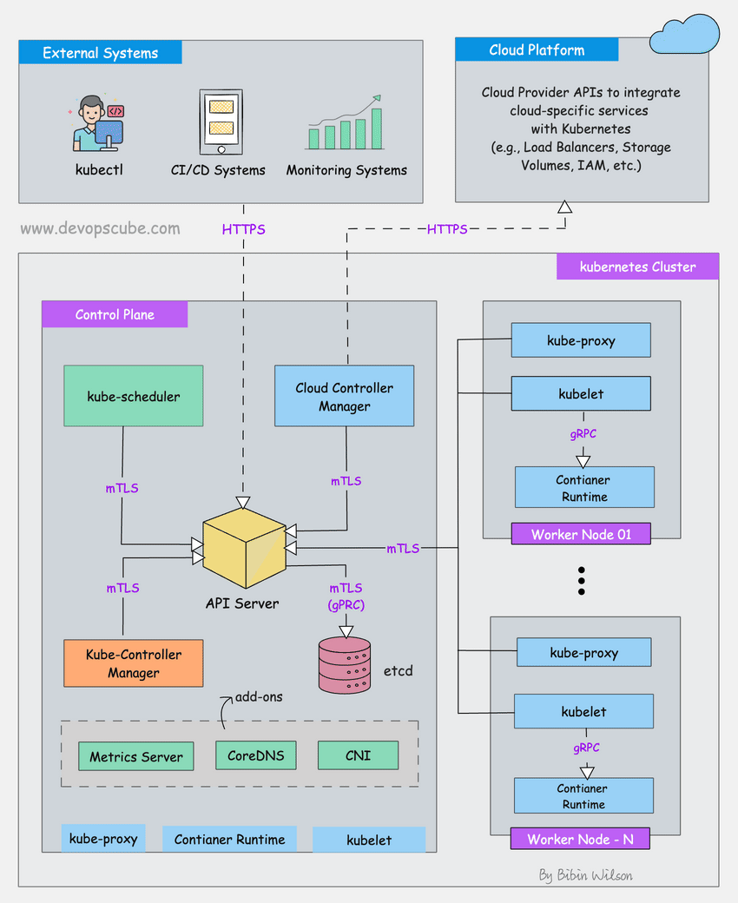
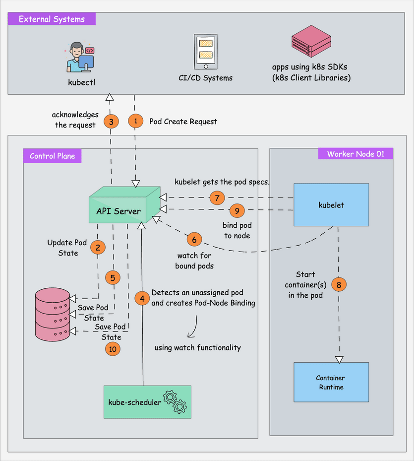
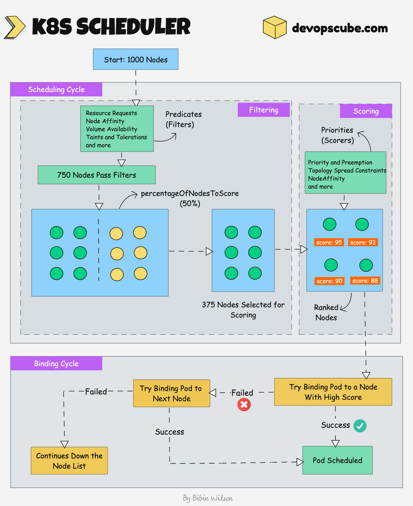
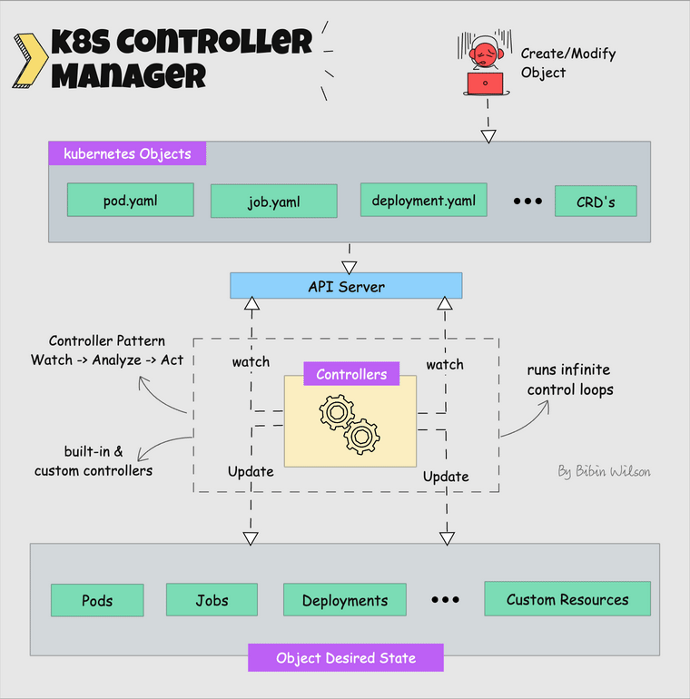

# Kiến trúc Kubernetes (Kubernetes Architecture Explained - 2026)

> Nguồn: [devopscube.com - Kubernetes Architecture Explained](https://devopscube.com/kubernetes-architecture-explained/)
> Tác giả: Bibin Wilson

## Tổng quan

Kubernetes là một **hệ thống phân tán (distributed system)**, gồm nhiều thành phần chạy trên các máy chủ khác nhau (VM hoặc bare-metal) kết nối qua mạng. Tập hợp các máy chủ này gọi là **Kubernetes Cluster**.

Một cluster gồm:

- **Control Plane Nodes**: chịu trách nhiệm điều phối container (orchestration) và duy trì trạng thái mong muốn của cluster.
- **Worker Nodes**: chạy các ứng dụng container hóa.



---

## I. Control Plane (Mặt phẳng điều khiển)

Gồm 5 thành phần chính:

1. kube-apiserver
2. etcd
3. kube-scheduler
4. kube-controller-manager
5. cloud-controller-manager

### 1. kube-apiserver

Là **trung tâm** của cluster, expose Kubernetes API. Mọi giao tiếp (kubectl, các component khác) đều đi qua API server thông qua **HTTP REST API qua TLS**.


Chức năng chính:

- Quản lý API, hỗ trợ nhiều phiên bản API đồng thời.
- Authentication (client cert, bearer token, HTTP Basic Auth) và Authorization (ABAC, RBAC).
- Validate/Mutate request thông qua Admission Controllers.
- Điều phối giao tiếp giữa control plane và worker node.
- Có **aggregation layer** để mở rộng API.
- Là component **duy nhất kết nối trực tiếp đến etcd**; mọi component khác kết nối đến API server.
- Hỗ trợ **watch** resource để nhận thông báo real-time khi tài nguyên thay đổi.
- Có sẵn **apiserver proxy** để truy cập ClusterIP service từ bên ngoài.

### 2. etcd

Là **bộ não** của cluster - một **distributed key-value store** mã nguồn mở, strongly consistent.


Đặc điểm:

- **Strongly consistent**: dữ liệu cập nhật được đồng bộ ngay tới tất cả node.
- **Distributed**: chạy như một cluster trên nhiều node.
- **Key-Value Store**: xây trên BboltDB (fork của BoltDB), expose API qua gRPC.
- Sử dụng **Raft consensus algorithm** theo mô hình leader-member.
- Lưu mọi config, state, metadata của Kubernetes objects (pods, secrets, deployments, configmaps...) dưới key `/registry/...`.
- Là component **duy nhất chạy StatefulSet** trong control plane.

Công thức fault tolerance:

```
fault tolerance = (n - 1) / 2
```

- 3 node → chịu được 1 node lỗi (quorum = 2)
- 5 node → chịu được 2 node lỗi (quorum = 3)
- 7 node → chịu được 3 node lỗi (quorum = 4)

### 3. kube-scheduler

Chịu trách nhiệm **chọn worker node phù hợp** để chạy pod, dựa trên yêu cầu (CPU, memory, affinity, taints/tolerations, priority, PV...).



Cách hoạt động: **Filtering → Scoring → Binding**



- **Filtering**: tìm các node đủ tài nguyên đáp ứng pod. Tham số `percentageOfNodesToScore` (mặc định ~50%, cluster lớn ~5%) quyết định tỷ lệ node được xét.
- **Scoring**: xếp hạng các node bằng các scheduling plugin, chọn node có điểm cao nhất (random nếu hòa).
- **Binding**: tạo binding event giữa pod và node được chọn trên API server.

Các thông tin quan trọng khác:

- Scheduler có 2 giai đoạn: **Scheduling cycle** và **Binding cycle** (gọi chung là scheduling context).
- Pod priority cao được ưu tiên lập lịch trước.
- Có thể tạo **custom scheduler** chạy song song với scheduler mặc định.
- Có **pluggable scheduling framework** để thêm plugin tùy chỉnh.
- Hỗ trợ **Dynamic Resource Allocation (DRA)** (stable từ v1.34) cho phần cứng đặc biệt (GPU, FPGA...), phục vụ AI/ML workload.

### 4. Kube Controller Manager

**Controller** là chương trình chạy control loop liên tục, theo dõi trạng thái thực tế (actual state) so với trạng thái mong muốn (desired state) và điều chỉnh cho khớp.



Kube Controller Manager quản lý các controller built-in quan trọng:

1. Deployment controller
2. ReplicaSet controller
3. DaemonSet controller
4. Job Controller
5. CronJob Controller
6. Endpoints controller
7. Namespace controller
8. ServiceAccounts controller
9. Node controller

Có thể mở rộng bằng **custom controllers** kết hợp với **Custom Resource Definitions (CRD)**.

### 5. Cloud Controller Manager (CCM)

Là **cầu nối giữa Cloud Platform API và Kubernetes cluster** khi chạy trên môi trường cloud, giúp core component của K8s hoạt động độc lập với cloud provider.


Gồm 3 controller chính:

1. **Node controller**: cập nhật thông tin node (label, hostname, CPU/memory, health...) từ cloud API.
2. **Route controller**: cấu hình route mạng để pod giữa các node giao tiếp được.
3. **Service controller**: triển khai load balancer cho Service, cấp IP...

Ví dụ thực tế: tạo Service type LoadBalancer, hoặc provision storage volume (PV) từ cloud storage.

---

## II. Worker Node (Node Worker)

Gồm 3 thành phần chính:

1. kubelet
2. kube-proxy (optional)
3. Container runtime

### 1. Kubelet

Là **agent** chạy trên mỗi node (dưới dạng daemon do systemd quản lý, không chạy như container).


Nhiệm vụ:

- Đăng ký worker node với API server.
- Làm việc với **podSpec** để tạo/sửa/xóa container đúng theo trạng thái mong muốn.
- Xử lý **liveness, readiness, startup probes**.
- Mount volume theo cấu hình pod.
- Thu thập và báo cáo trạng thái node/pod (qua `cAdvisor` và `CRI`).

Đặc điểm khác:

- Có thể nhận podSpec từ file, HTTP endpoint, HTTP server (không chỉ từ API server) → ví dụ: **static pods** (dùng để bootstrap control plane từ `/etc/kubernetes/manifests`, không được API server quản lý).
- Giao tiếp với container runtime qua **CRI (gRPC)**.
- Cấu hình block volume qua **CSI (gRPC)**.
- Cấu hình network cho pod qua **CNI plugin**.
- Từ v1.35 (GA): kubelet hỗ trợ **in-place pod resize** - thay đổi CPU/memory request/limit khi pod đang chạy mà không cần restart container.

### 2. Kube-proxy (Optional)

Daemon chạy trên mọi node (dạng DaemonSet), triển khai khái niệm **Service** của Kubernetes (load balancing, service discovery cho UDP/TCP/SCTP, không hiểu HTTP).


Cách hoạt động: lấy thông tin Service (ClusterIP) và Endpoints từ API server, sau đó tạo/cập nhật rule định tuyến traffic đến pod.

Các mode hoạt động:

1. **IPTables** (default): tạo iptables rule cho mỗi service, chọn pod backend random.
2. **NFTables**: cải thiện hiệu năng/khả năng mở rộng so với iptables ở cluster lớn.
3. **Userspace** (legacy, không khuyến nghị).
4. **Kernelspace**: chỉ dành cho Windows.

> Lưu ý: kube-proxy được gọi là "optional" vì các CNI plugin hiện đại (ví dụ **Cilium** dùng eBPF) có thể tự xử lý packet forwarding/load balancing mà không cần kube-proxy.

### 3. Container Runtime

Phần mềm cần thiết để **chạy container** trên mỗi node, đảm nhiệm pull image, chạy container, cấp phát/cô lập tài nguyên, quản lý lifecycle container.


Hai khái niệm quan trọng:

- **CRI (Container Runtime Interface)**: tập API cho phép Kubernetes giao tiếp với nhiều container runtime khác nhau (CRI-O, containerd, Docker Engine...).
- **OCI (Open Container Initiative)**: chuẩn cho định dạng và runtime của container.

Ví dụ workflow với **CRI-O**:

1. Kubelet nhận yêu cầu pod từ API server → gọi CRI-O qua CRI để khởi tạo container.
2. CRI-O pull image từ registry qua thư viện `containers/image`.
3. CRI-O tạo OCI runtime specification (JSON).
4. CRI-O dùng OCI runtime (runc) để khởi chạy container process.

---

## III. Addon Components (Thành phần bổ sung)

Cần thiết để cluster hoạt động đầy đủ:

1. **CNI Plugin (Container Network Interface)**
2. **CoreDNS**: DNS server nội bộ cluster, hỗ trợ DNS-based service discovery.
3. **Metrics Server**: thu thập dữ liệu hiệu năng và resource usage của node/pod.
4. **Web UI (Kubernetes Dashboard)**: quản lý object qua giao diện web.

### CNI Plugin

CNI là kiến trúc plugin chuẩn (vendor-neutral) để tạo network interface cho container, không chỉ riêng cho Kubernetes (còn dùng cho Mesos, Podman, Docker...).


Cách hoạt động:

1. **kube-controller-manager** gán Pod CIDR cho mỗi node; mỗi pod nhận IP duy nhất từ CIDR đó.
2. Kubelet tương tác với container runtime; phần CRI của runtime gọi CNI plugin để cấu hình network cho pod.
3. CNI plugin cho phép pod giao tiếp xuyên node qua **overlay network**.

Chức năng chính:

- Pod networking.
- Network security & isolation qua **Network Policies**.

Một số CNI plugin phổ biến: Calico, Flannel, Cilium (eBPF), Amazon VPC CNI, Azure CNI.

---

## IV. Các Kubernetes Object chính (do kiến trúc quản lý)

### Workload Objects

- **Pod**: đơn vị deploy nhỏ nhất.
- **ReplicaSet**: đảm bảo số lượng pod replica.
- **Deployment**: quản lý ReplicaSet và rolling update.
- **DaemonSet**: chạy 1 bản copy pod trên mỗi node được chọn.
- **StatefulSet**: quản lý ứng dụng stateful, có identity ổn định.
- **Jobs & CronJobs**: chạy task theo batch hoặc lịch.

### Configuration & Secrets

- **ConfigMaps**: dữ liệu cấu hình không nhạy cảm.
- **Secrets**: dữ liệu nhạy cảm (credentials...).

### Networking

- **Services**: endpoint mạng ổn định cho pod.
- **Ingress**: routing HTTP/S.
- **Gateway API**: phiên bản nâng cao của Ingress, hỗ trợ service mesh.
- **Network Policies**: định nghĩa rule allow/deny traffic.

### Mở rộng

- **CRD (Custom Resource Definitions)**: mở rộng API K8s với object type mới.
- **Custom Controllers / Operators**: tự động hóa hành vi của các custom object.

Với workload AI/ML, Kubernetes hỗ trợ thêm: Device Plugins, Gateway API Inference, OCI Image Volumes.

---

## V. FAQ

**Vai trò chính của Control Plane?**
Duy trì trạng thái mong muốn của cluster và ứng dụng; gồm API server, etcd, Scheduler, Controller Manager.

**Vai trò của Worker Node?**
Chạy container thực tế của các pod, được điều khiển bởi control plane.

**Giao tiếp giữa Control Plane và Worker Node được bảo mật thế nào?**
Qua PKI certificates và TLS, chỉ component tin cậy mới giao tiếp được với nhau.

**Vai trò của etcd?**
Lưu trữ object, thông tin cluster/node, dữ liệu cấu hình - bao gồm desired state của ứng dụng.

**Nếu etcd down thì sao?**
Ứng dụng đang chạy không bị ảnh hưởng, nhưng không thể tạo/cập nhật object mới.

**Kube-proxy còn cần thiết không?**
Không bắt buộc - nhiều cluster hiệu năng cao hiện dùng eBPF (như Cilium) thay thế.

**Kubernetes là PaaS hay IaaS?**
Có cả hai đặc tính, vì là platform điều phối container.

**L4 và L7 routing trong Kubernetes là gì?**

- L4: Service object dùng IP + Port.
- L7: Gateway API dùng thông tin HTTP (path, host...).

---

## Kết luận

Kubernetes không còn chỉ là công cụ "container orchestration" mà đang trở thành **distributed operating system cho thời đại AI**, với các tính năng năm 2026 như: **in-place scaling**, **GPU-centric scheduling**, và **eBPF-powered networking**.

---

_Tổng hợp từ: [devopscube.com/kubernetes-architecture-explained](https://devopscube.com/kubernetes-architecture-explained/)_
