# Kubernetes Ingress, Ingress Controller & Gateway API

> 📖 Nguồn tổng hợp từ:
> - [DevOpsCube — Kubernetes Ingress Tutorial for Beginners](https://devopscube.com/kubernetes-ingress-tutorial/)
> - [DevOpsCube — Setup Nginx Ingress Controller on Kubernetes](https://devopscube.com/setup-ingress-kubernetes-nginx-controller/)
> - [Gateway API Official Docs](https://gateway-api.sigs.k8s.io/docs/introduction/)

---

## Tại sao cần Ingress?

Service `LoadBalancer` giải quyết external access, nhưng mỗi service cần **1 cloud load balancer riêng** → tốn tiền và khó quản lý khi có nhiều microservices.

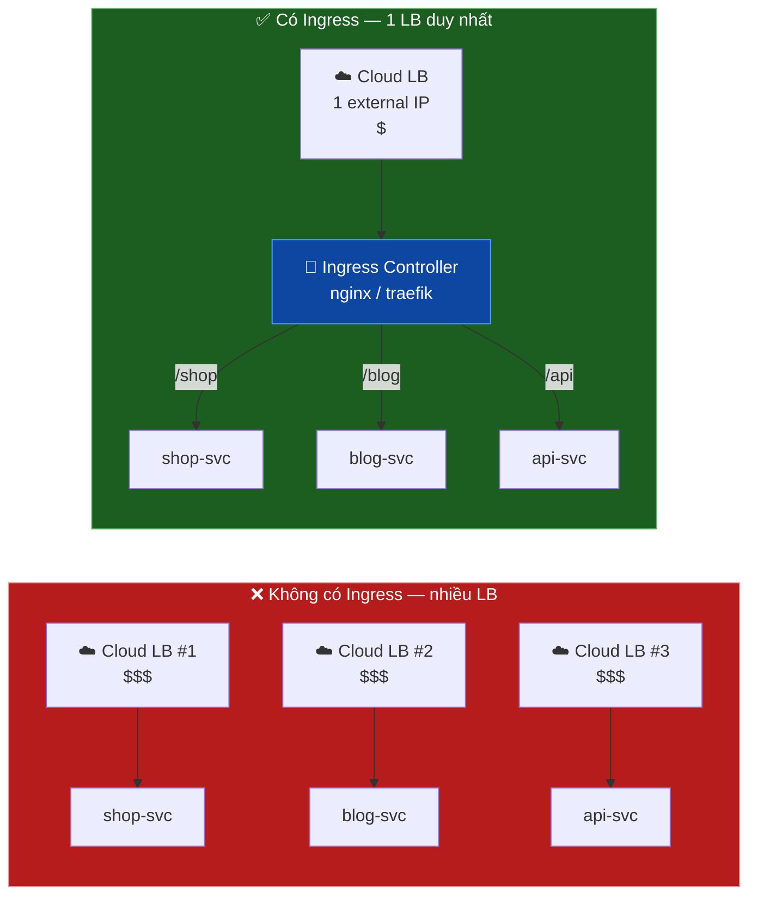

---

## 1. Ingress Resource (Object)

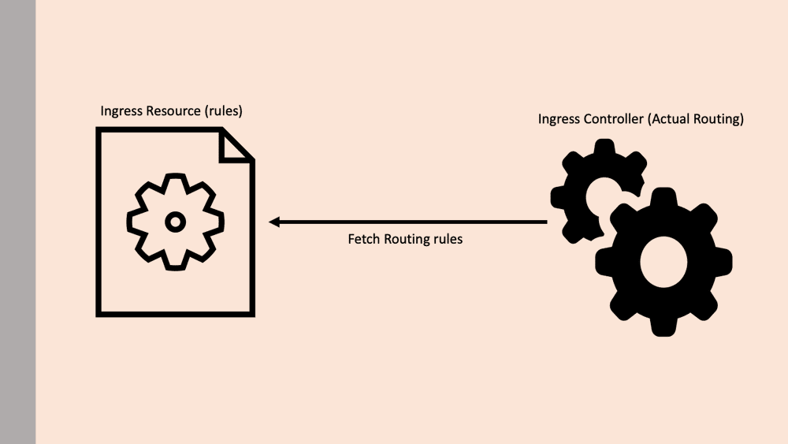

> Ingress là **Kubernetes native object** (như Pod, Deployment). Nó chỉ **chứa routing rules** — không tự làm routing.

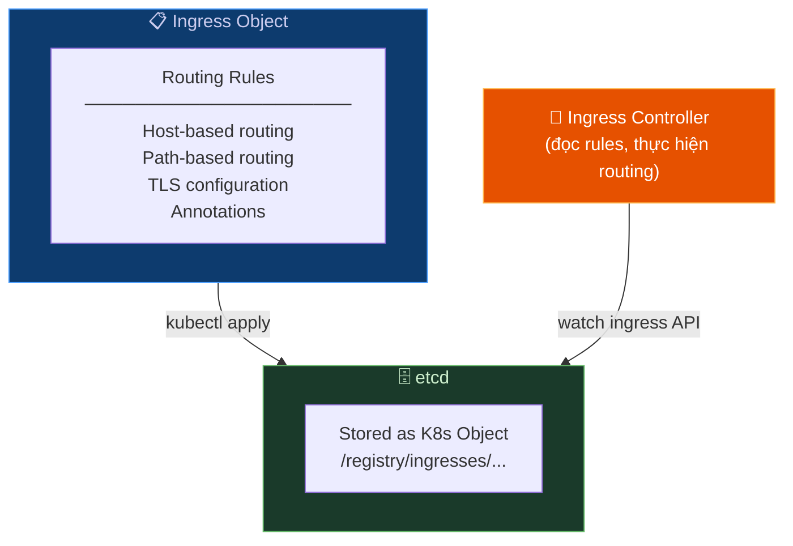

### YAML — Path-based Routing

```yaml
apiVersion: networking.k8s.io/v1
kind: Ingress
metadata:
  name: ecommerce-ingress
  namespace: production
  annotations:
    nginx.ingress.kubernetes.io/rewrite-target: /
spec:
  ingressClassName: nginx          # Chỉ định Ingress Controller nào xử lý

  # TLS configuration
  tls:
    - hosts:
        - www.example.com
      secretName: example-tls-cert  # K8s Secret chứa cert

  rules:
    # Rule 1: Path-based routing
    - host: www.example.com
      http:
        paths:
          - path: /shop
            pathType: Prefix
            backend:
              service:
                name: shop-svc
                port:
                  number: 80
          - path: /blog
            pathType: Prefix
            backend:
              service:
                name: blog-svc
                port:
                  number: 80
          - path: /api
            pathType: Prefix
            backend:
              service:
                name: api-svc
                port:
                  number: 3000

    # Rule 2: Host-based routing
    - host: admin.example.com
      http:
        paths:
          - path: /
            pathType: Prefix
            backend:
              service:
                name: admin-svc
                port:
                  number: 80
```

### Path Types

| pathType | Hành vi | Ví dụ |
|---|---|---|
| `Exact` | Match chính xác | `/shop` chỉ match `/shop` |
| `Prefix` | Match prefix | `/shop` match `/shop`, `/shop/cart`, `/shop/pay` |
| `ImplementationSpecific` | Tùy controller | Behavior phụ thuộc Nginx/Traefik |

---

## 2. Ingress Controller

> Ingress Controller là **phần làm việc thật sự** — đọc Ingress rules và route traffic. Không có sẵn trong K8s, cần cài thêm.

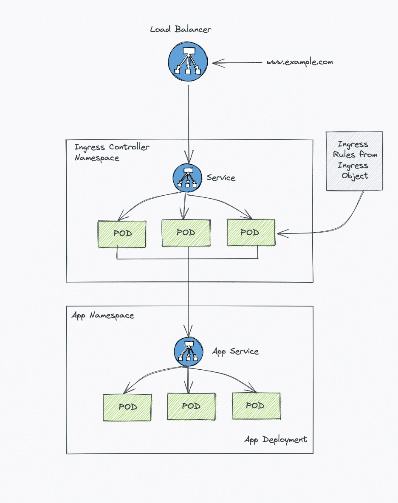

### Cơ chế hoạt động — Nginx Ingress Controller

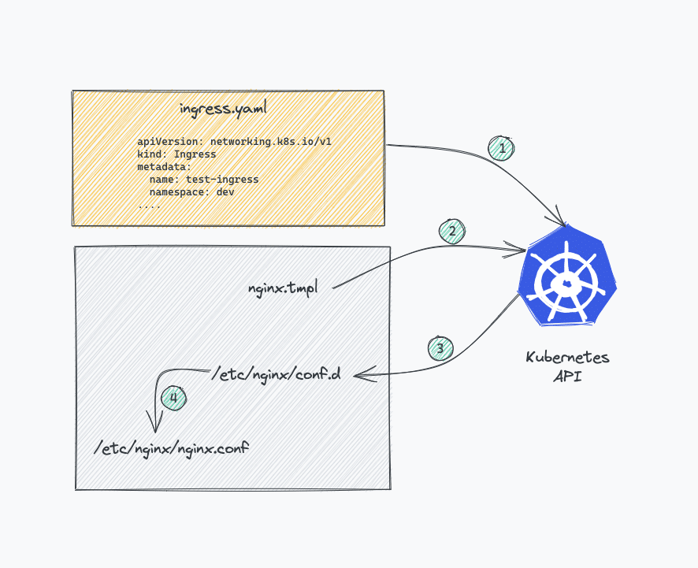

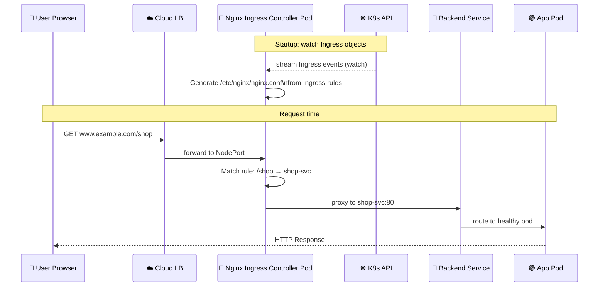

### Nginx config được generate tự động

```nginx
# /etc/nginx/conf.d/production-ecommerce-ingress.conf
# Auto-generated từ Ingress object

upstream shop-svc-80 {
    server 10.1.0.10:80;  # Pod IPs
    server 10.1.0.11:80;
}

server {
    listen 80;
    server_name www.example.com;

    location /shop {
        proxy_pass http://shop-svc-80;
    }
    location /blog {
        proxy_pass http://blog-svc-80;
    }
}
```

---

## 3. Nginx Ingress Controller — Kiến trúc chi tiết

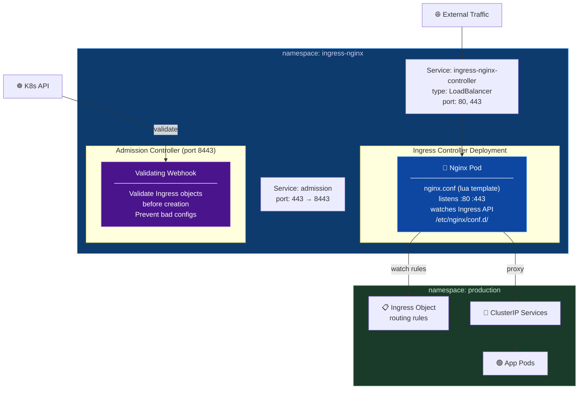

### Admission Controller — validate Ingress objects

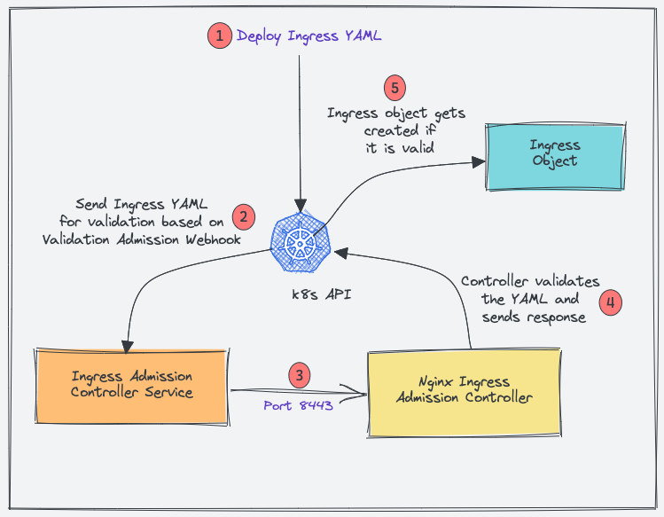

Admission Controller ngăn deploy Ingress với config sai — bảo vệ tất cả routing rules hiện tại:

```
kubectl apply -f bad-ingress.yaml
    │
    ▼
K8s API Server
    │ gửi đến ValidatingWebhookConfiguration
    ▼
Nginx Admission Controller :8443
    │ validate ingress spec
    ├── ✅ Valid → tạo Ingress object
    └── ❌ Invalid → reject với error message
```

---

## 4. Cài đặt Nginx Ingress Controller

### Bằng Helm (khuyến nghị production)

```bash
# Add repo
helm repo add ingress-nginx https://kubernetes.github.io/ingress-nginx
helm repo update

# Install
helm install ingress-nginx ingress-nginx/ingress-nginx \
  --namespace ingress-nginx \
  --create-namespace \
  --set controller.replicaCount=2 \
  --set controller.nodeSelector."kubernetes\.io/os"=linux

# Verify
kubectl get pods -n ingress-nginx
kubectl get svc -n ingress-nginx
```

### Bằng Manifest (dev/learning)

```bash
# Clone manifests
git clone https://github.com/techiescamp/nginx-ingress-controller
cd nginx-ingress-controller/manifests

# Deploy tất cả
kubectl apply -f .

# Kiểm tra
kubectl get all -n ingress-nginx
```

### Các K8s objects được tạo

```
ingress-nginx namespace
├── ServiceAccount: ingress-nginx + ingress-nginx-admission
├── ClusterRole/ClusterRoleBinding (admission + controller)
├── Role/RoleBinding (admission + controller)
├── ValidatingWebhookConfiguration: ingress-nginx-admission
├── Jobs: create + patch webhook CA bundle
├── ConfigMap: nginx controller config
├── Deployment: ingress-nginx-controller
└── Services:
    ├── ingress-nginx-controller (LoadBalancer: 80, 443)
    └── ingress-nginx-controller-admission (ClusterIP: 443)
```

---

## 5. So sánh Ingress Controllers phổ biến

| Controller | Công ty | Use Case | Điểm nổi bật |
|---|---|---|---|
| **Nginx (community)** | Kubernetes | General purpose | Phổ biến nhất, tài liệu phong phú |
| **Nginx (Nginx Inc)** | F5/Nginx | Enterprise | Commercial support |
| **Traefik** | Traefik Labs | Microservices | Auto-discover, dashboard đẹp |
| **HAProxy** | HAProxy Tech | High performance | Rất nhanh, nhiều protocol |
| **Contour** | VMware | Envoy-based | HTTP/2, gRPC support tốt |
| **AWS ALB Controller** | AWS | EKS | Tích hợp native AWS ALB |
| **GKE Ingress** | Google | GKE | Google Cloud LB integration |
| **Azure AGIC** | Microsoft | AKS | Azure Application Gateway |

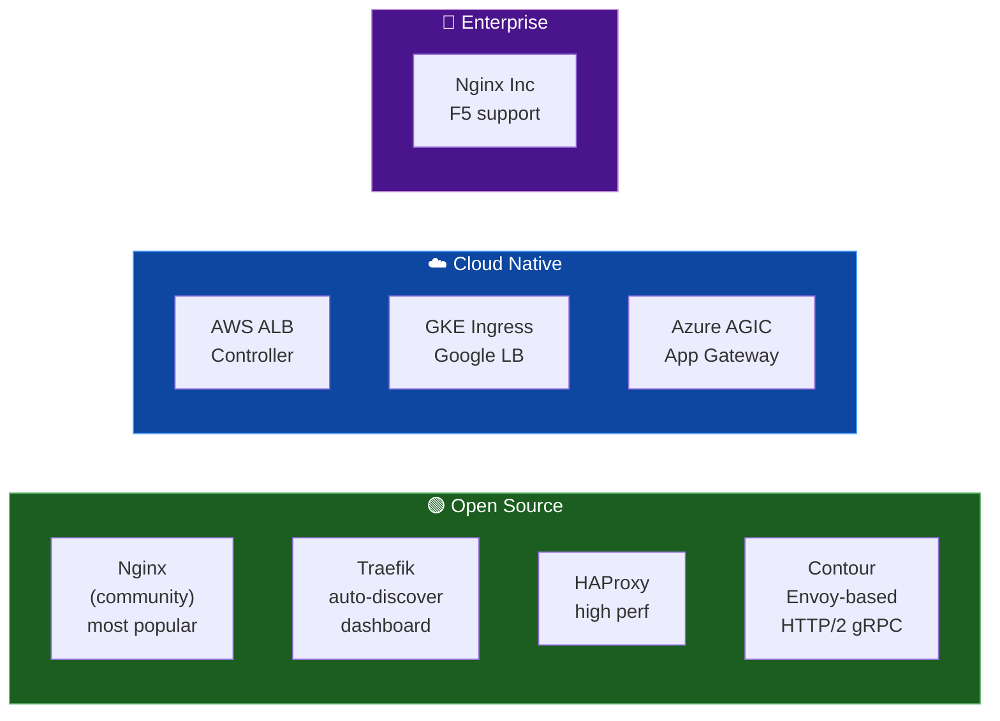

---

## 6. Gateway API — Thế hệ kế tiếp của Ingress

> Gateway API là **next-gen Ingress** — expressive hơn, role-oriented, hỗ trợ cả North-South (Ingress) lẫn East-West (Service Mesh).

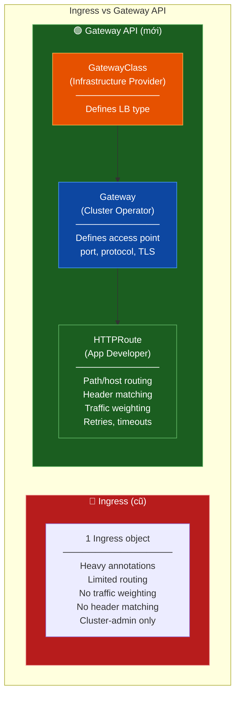

### 3 Roles trong Gateway API

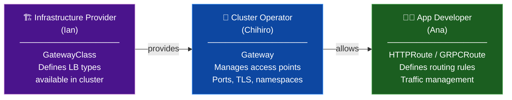

### YAML Example — Gateway API

```yaml
# GatewayClass (Infrastructure Provider)
apiVersion: gateway.networking.k8s.io/v1
kind: GatewayClass
metadata:
  name: nginx-gateway
spec:
  controllerName: k8s.nginx.org/nginx-gateway-controller
---
# Gateway (Cluster Operator)
apiVersion: gateway.networking.k8s.io/v1
kind: Gateway
metadata:
  name: main-gateway
  namespace: infra
spec:
  gatewayClassName: nginx-gateway
  listeners:
    - name: http
      port: 80
      protocol: HTTP
    - name: https
      port: 443
      protocol: HTTPS
      tls:
        certificateRefs:
          - name: example-tls-cert
---
# HTTPRoute (App Developer) — với traffic weighting
apiVersion: gateway.networking.k8s.io/v1
kind: HTTPRoute
metadata:
  name: shop-route
  namespace: production
spec:
  parentRefs:
    - name: main-gateway
      namespace: infra
  hostnames:
    - "www.example.com"
  rules:
    # Path matching
    - matches:
        - path:
            type: PathPrefix
            value: /shop
      backendRefs:
        - name: shop-svc
          port: 80
          weight: 90      # 90% traffic → stable
        - name: shop-svc-canary
          port: 80
          weight: 10      # 10% → canary version

    # Header-based routing
    - matches:
        - headers:
            - name: X-User-Type
              value: premium
      backendRefs:
        - name: premium-svc
          port: 80
```

### So sánh Ingress vs Gateway API

| Tính năng | Ingress | Gateway API |
|---|:---:|:---:|
| **Traffic weighting** | ❌ (custom annotation) | ✅ native |
| **Header-based routing** | ❌ (custom annotation) | ✅ native |
| **gRPC routing** | ❌ | ✅ GRPCRoute |
| **Cross-namespace** | ❌ | ✅ |
| **Role separation** | ❌ one object | ✅ GatewayClass/Gateway/Route |
| **Service Mesh support** | ❌ | ✅ GAMMA initiative |
| **Retries & timeouts** | ❌ | ✅ |
| **Maturity** | Stable (GA) | Stable (v1.0+) |

---

## 7. Tổng quan kiến trúc hoàn chỉnh

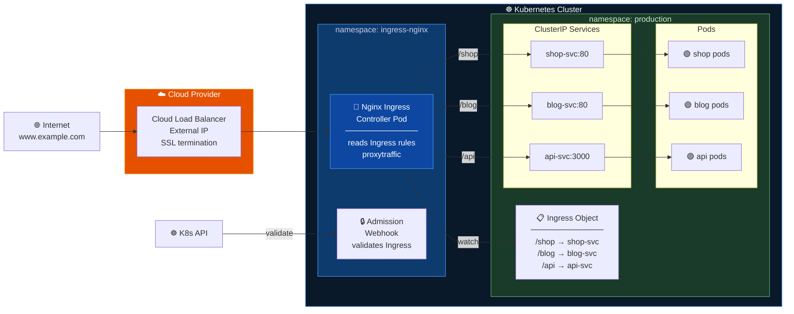

---

## 8. Commands tham khảo

```bash
# Xem Ingress objects
kubectl get ingress -A
kubectl describe ingress <name> -n <namespace>

# Xem Ingress Controller logs (troubleshoot routing)
kubectl logs -n ingress-nginx \
  deployment/ingress-nginx-controller --tail=100

# Xem nginx.conf được generate
kubectl exec -n ingress-nginx \
  deployment/ingress-nginx-controller -- cat /etc/nginx/nginx.conf

# Test routing
curl -H "Host: www.example.com" http://<node-ip>:<nodeport>/shop

# Xem IngressClass
kubectl get ingressclass

# Port-forward Ingress Controller để test local
kubectl port-forward -n ingress-nginx svc/ingress-nginx-controller 8080:80
curl -H "Host: www.example.com" http://localhost:8080/shop
```
