# Kubernetes Objects vs Resources vs Custom Resources

> 📖 Nguồn: [DevOpsCube — Kubernetes Objects Vs Resources Vs Custom Resource](https://devopscube.com/kubernetes-objects-resources/)  
> ✍️ Tác giả: Bibin Wilson | 📅 Mar 8, 2024

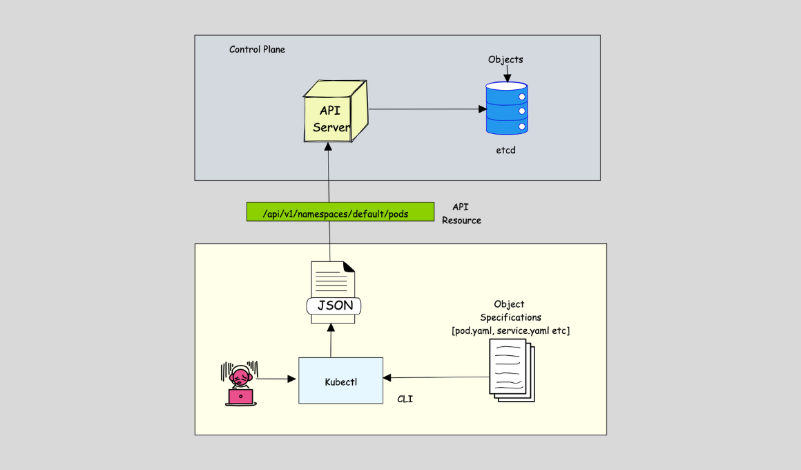

---

## Tổng quan

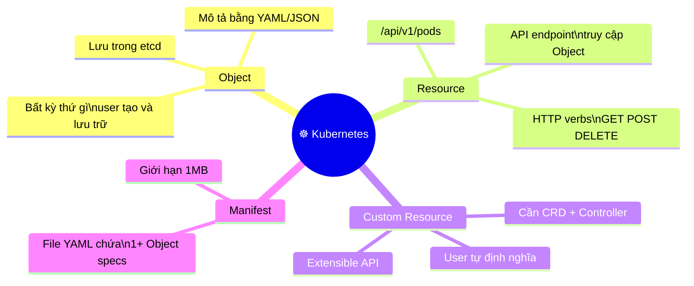

---

## 1. Kubernetes Object là gì?

**Object** là bất kỳ thứ gì user tạo ra và được Kubernetes lưu trữ — Pod, Deployment, Service, Namespace, Secret, Volume...

### Lưu trữ trong etcd

Mọi Object đều được persist vào **etcd** dưới thư mục `/registry`:

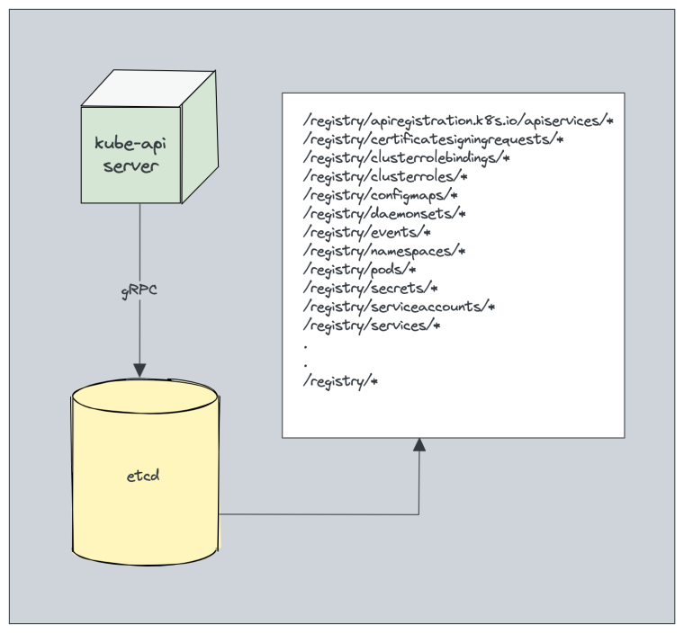

```
/registry/pods/default/nginx
/registry/deployments/production/web-app
/registry/services/visualizer/k8s-visualizer-be
```

### Mô tả Object — Object Specification

```yaml
# Pod Object Specification
apiVersion: v1
kind: Pod
metadata:
  name: webserver-pod
spec:
  containers:
    - name: webserver
      image: nginx:latest
      ports:
        - containerPort: 80
```

### Các loại Object native của Kubernetes

| Category | Objects |
|---|---|
| **Workload** | Pods, ReplicaSets, Deployments, StatefulSets, DaemonSets, Jobs, CronJobs, HPA, VPA |
| **Service & Networking** | Services, Ingress, IngressClasses, NetworkPolicies, Endpoints, EndpointSlices |
| **Storage** | PersistentVolumes, PersistentVolumeClaims, StorageClasses |
| **Configuration** | ConfigMaps, Namespaces, ResourceQuotas, LimitRanges, PodDisruptionBudgets |
| **Security** | Secrets, ServiceAccounts, Roles, RoleBindings, ClusterRoles, ClusterRoleBindings |
| **Metadata** | Labels & Selectors, Annotations, Finalizers |

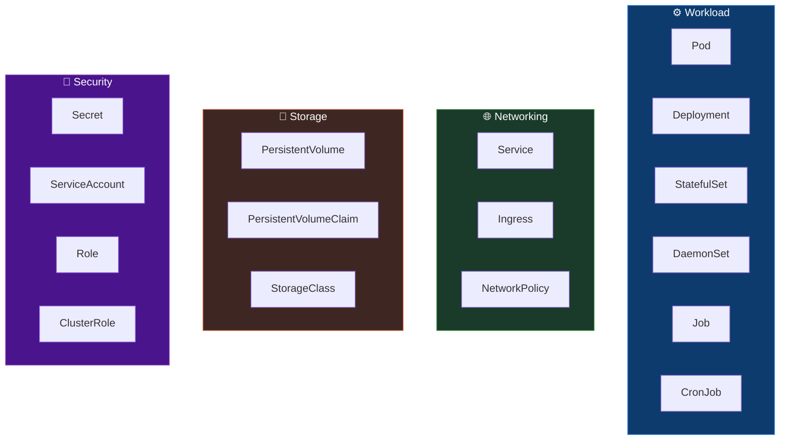

---

## 2. Common Object Parameters

Mọi Kubernetes Object đều có 4 trường bắt buộc:

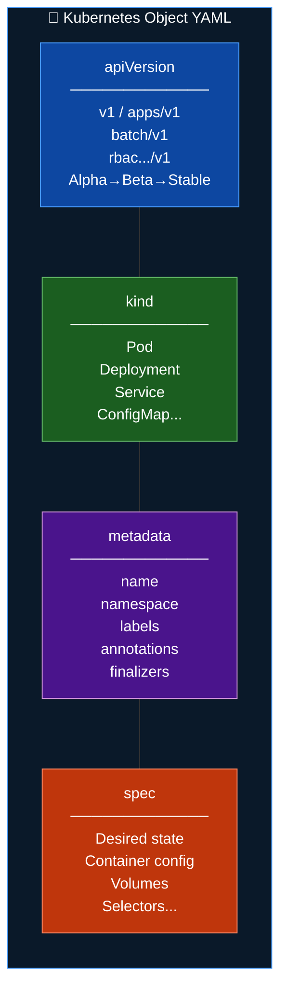

| Parameter | Mô tả | Ví dụ |
|---|---|---|
| `apiVersion` | Phiên bản API | `v1`, `apps/v1`, `rbac.../v1` |
| `kind` | Loại Object | `Pod`, `Deployment`, `Service` |
| `metadata` | Định danh Object | `name`, `namespace`, `labels`, `annotations` |
| `spec` | Desired state | Container image, ports, volumes, selectors |

---

## 3. Object UID

Mỗi Object được tạo ra có một **UUID duy nhất**:

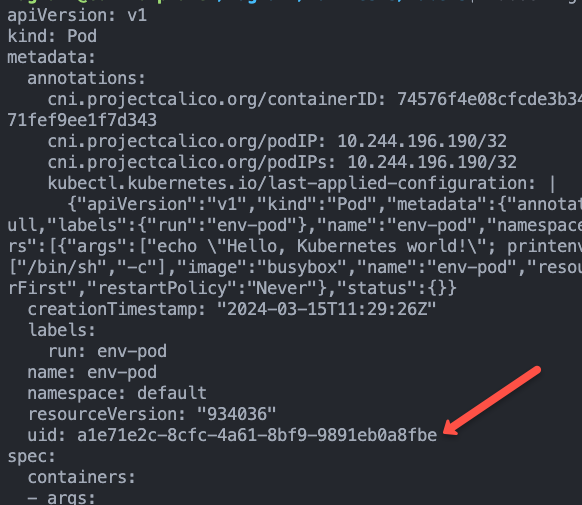

```bash
# Xem UID của pod
kubectl describe pod <pod-name> | grep UID

# Hoặc qua JSON
kubectl get pod <pod-name> -o jsonpath='{.metadata.uid}'
```

> **Quy tắc:**
> - Không thể có 2 Pod cùng tên trong cùng namespace
> - Có thể có Pod `webserver` và Deployment `webserver` cùng tồn tại
> - Dùng `labels` + `annotations` nếu cần identifier không unique

---

## 4. Kubernetes Resource là gì?

**Resource** = API endpoint cụ thể để truy cập một Object qua HTTP.

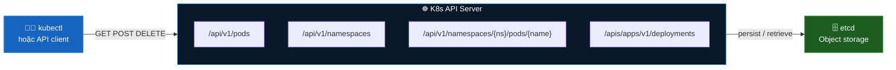

### Object vs Resource — luồng kubectl apply

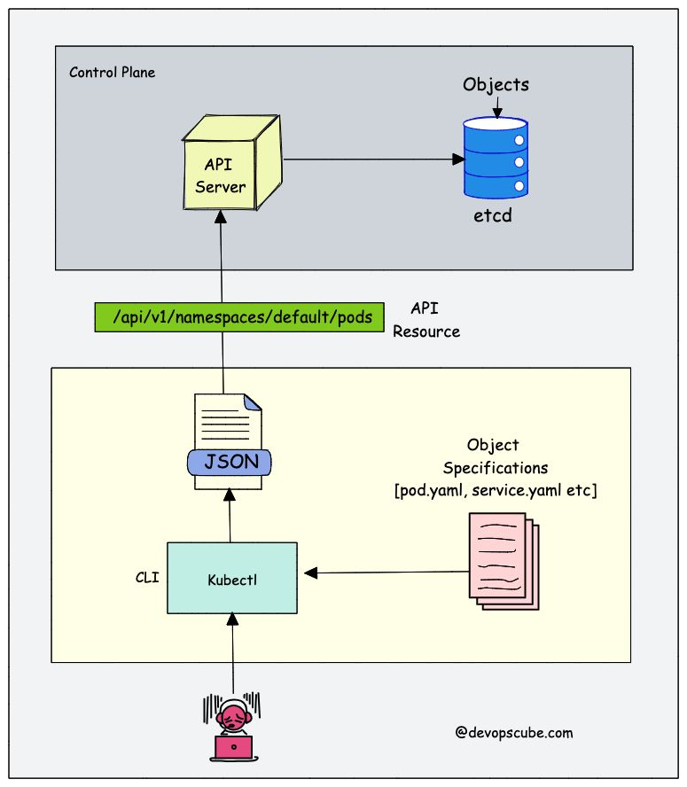

```
kubectl apply -f pod.yaml
       │
       ▼ YAML → JSON
kubectl client
       │
       ▼ POST /api/v1/namespaces/default/pods
K8s API Server
       │
       ▼ validate + store
etcd /registry/pods/default/pod-name
```

### API Resource endpoints phổ biến

| Endpoint | HTTP Verb | Mô tả |
|---|---|---|
| `/api/v1/namespaces` | GET | Liệt kê tất cả namespace |
| `/api/v1/pods` | GET | Liệt kê tất cả pod (all namespaces) |
| `/api/v1/namespaces/{ns}/pods` | GET / POST | List hoặc tạo pod trong namespace |
| `/api/v1/namespaces/{ns}/pods/{name}` | GET / DELETE | Xem hoặc xóa pod cụ thể |
| `/apis/apps/v1/namespaces/{ns}/deployments` | GET / POST | Quản lý Deployment |

> ⚠️ Phân biệt: "Pod resource" (API endpoint `/api/v1/pods`) ≠ "Pod" (generic term cho workload)

---

## 5. Kubernetes Custom Resource

Khi native K8s Objects không đủ, bạn có thể **tự định nghĩa Resource**.

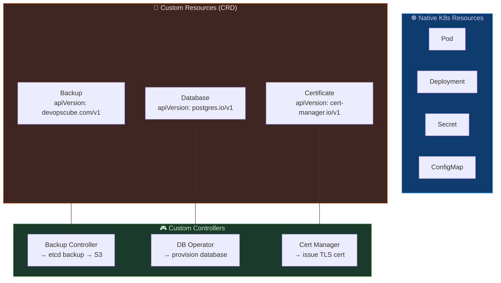

### Ví dụ — Custom Resource "Backup"

```yaml
# Custom Resource Definition (CRD) object spec
apiVersion: devopscube.com/v1
kind: Backup
metadata:
  name: my-backup
spec:
  etcdEndpoint: http://etcd:2379
  s3Bucket: my-bucket
  s3Region: us-west-2
```

Khi apply file này:
1. K8s API nhận request, validate theo CRD schema
2. Object được lưu vào etcd
3. **Custom Controller** (do user viết) detect → thực hiện etcd backup → upload S3

> 💡 Ví dụ CRD phổ biến trong thực tế: **ArgoCD** (`Application`, `AppProject`), **Cert-Manager** (`Certificate`), **Prometheus Operator** (`ServiceMonitor`, `PrometheusRule`)

### So sánh 3 khái niệm

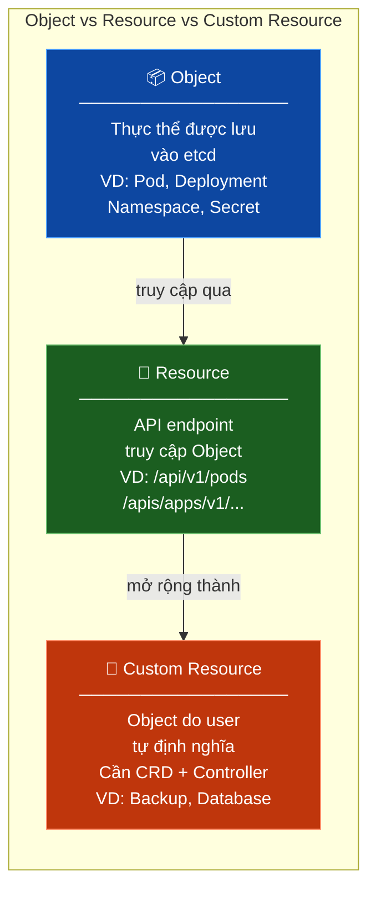

---

## 6. Kubernetes Manifest

**Manifest** = file YAML chứa một hoặc nhiều Object specifications.

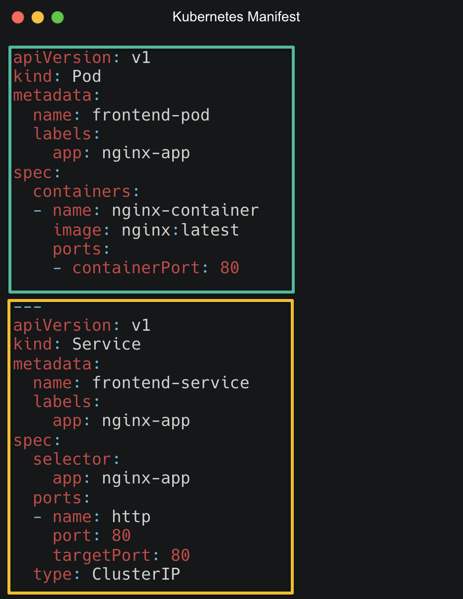

```yaml
# Một manifest có thể chứa nhiều Object (ngăn cách bằng ---)
---
apiVersion: v1
kind: Pod
metadata:
  name: webserver-pod
  namespace: production
spec:
  containers:
    - name: nginx
      image: nginx:latest
      ports:
        - containerPort: 80
---
apiVersion: v1
kind: Service
metadata:
  name: webserver-svc
  namespace: production
spec:
  selector:
    app: webserver
  ports:
    - port: 80
      targetPort: 80
  type: ClusterIP
```

```bash
# Apply toàn bộ manifest
kubectl apply -f manifest.yaml

# Apply cả folder
kubectl apply -f ./manifests/

# Dry-run để kiểm tra trước
kubectl apply -f manifest.yaml --dry-run=client
```

**Giới hạn manifest:**
- Mặc định: **1MB** per file
- Không giới hạn số Object trong 1 file, nhưng nên tách nhỏ để dễ quản lý

---

## 7. Liên hệ với project K8s Visualizer

Project này sử dụng đầy đủ các loại Object:

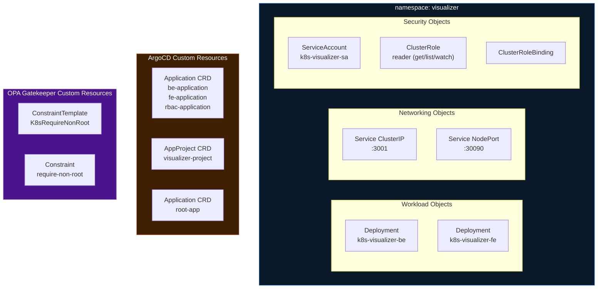

---

## 8. Tóm tắt

| Khái niệm | Định nghĩa | Ví dụ |
|---|---|---|
| **Object** | Thực thể lưu trong etcd, mô tả bằng YAML | `Pod`, `Deployment`, `Secret` |
| **Resource** | API endpoint truy cập Object | `/api/v1/pods`, `/apis/apps/v1/deployments` |
| **Custom Resource** | Object do user định nghĩa qua CRD | `Application` (ArgoCD), `Certificate` (Cert-Manager) |
| **Manifest** | File YAML chứa 1+ Object spec | `deployment.yaml`, `service.yaml` |
| **Object UID** | UUID unique cho mỗi Object | `eccb772b-1508-4d91-b902-86c762f096cf` |
| **apiVersion** | Version của K8s API group | `v1`, `apps/v1`, `argoproj.io/v1alpha1` |
