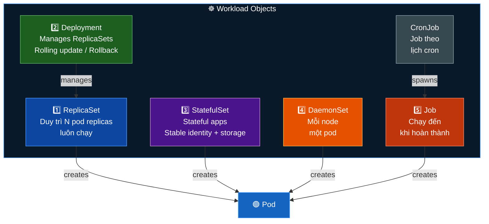
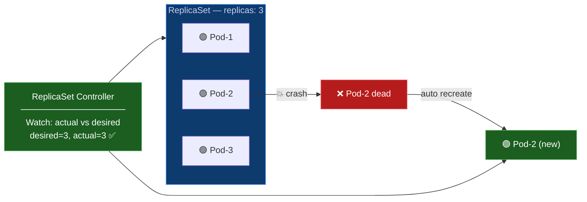
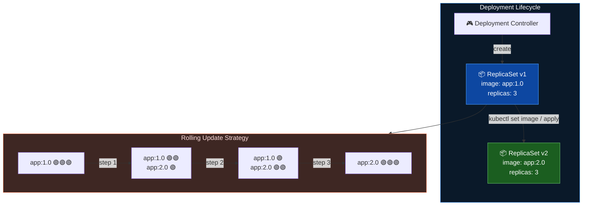
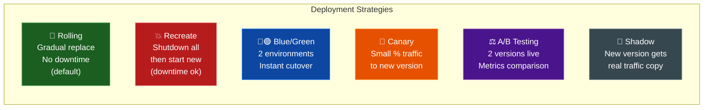
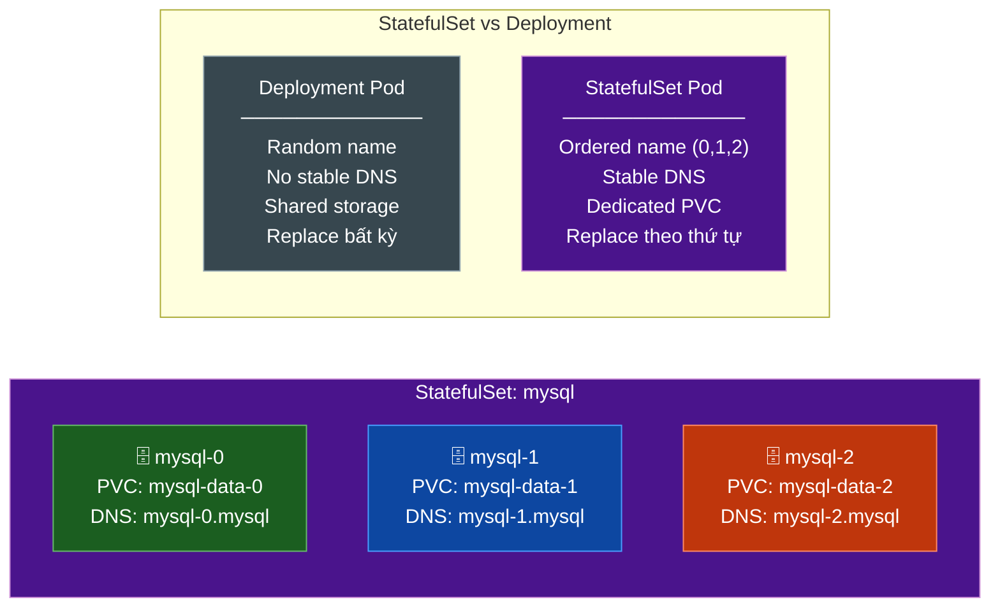
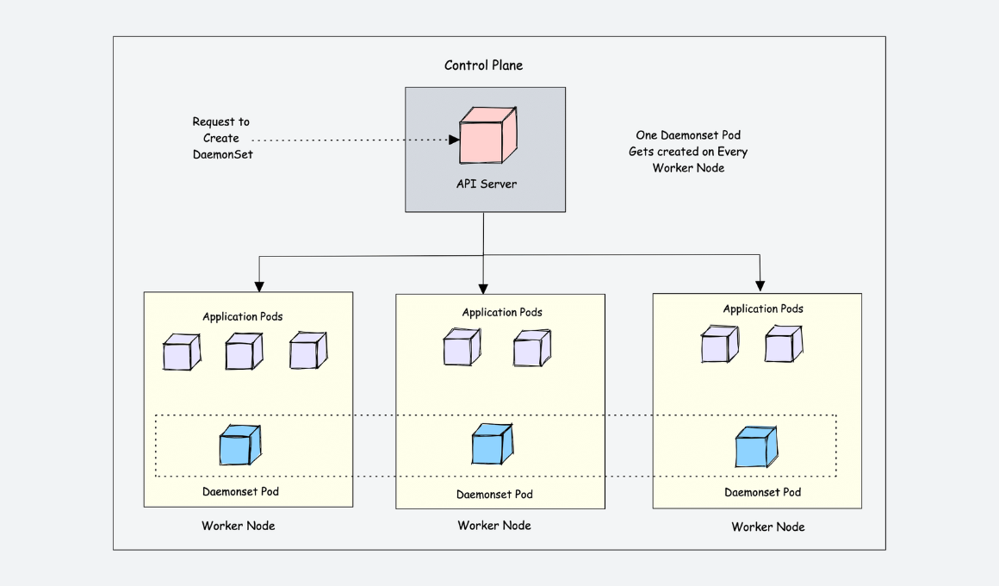
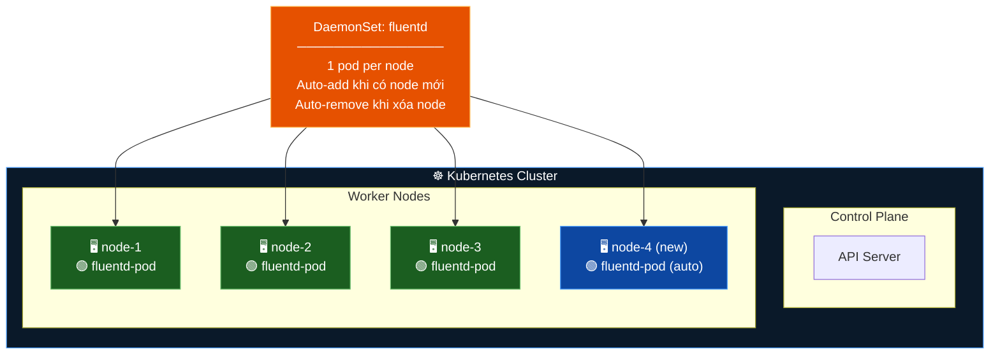
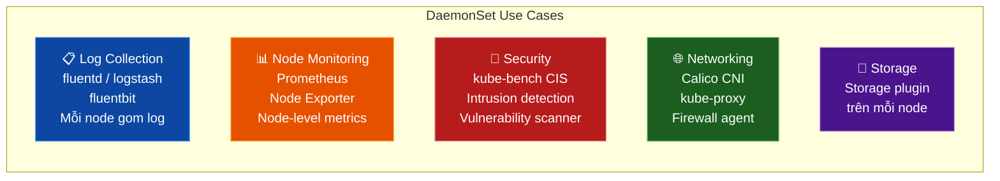
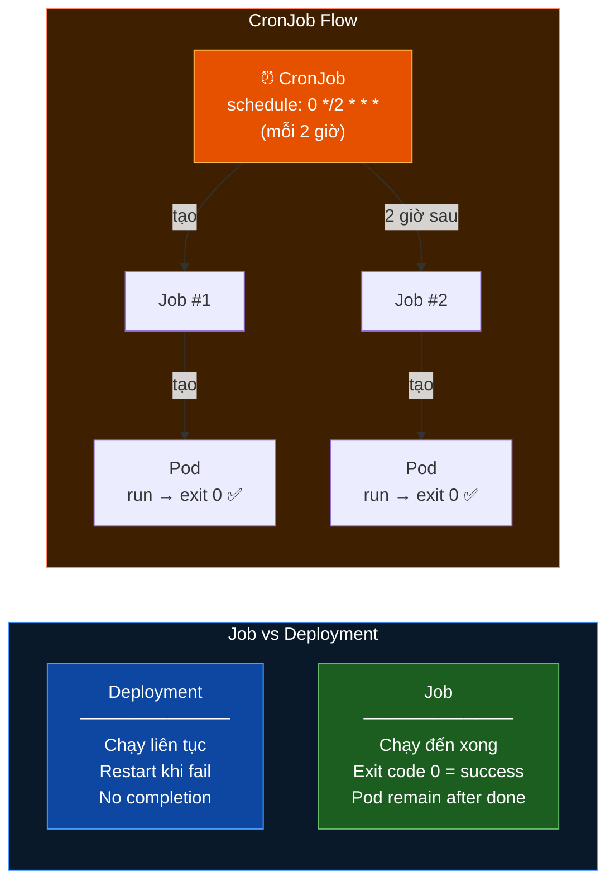
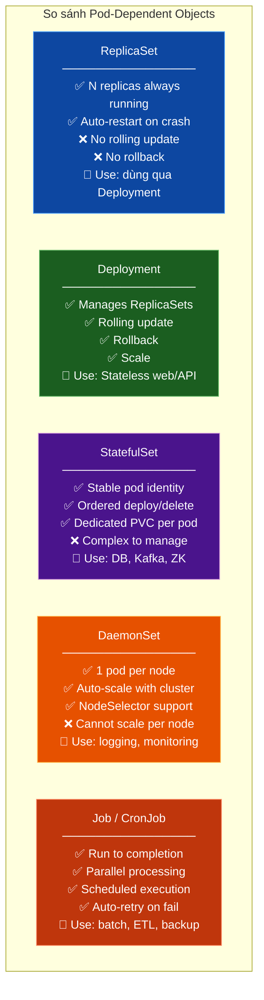

# Kubernetes Pod-Dependent Objects

> 📖 Nguồn tổng hợp từ:
> - [Sysdig — Kubernetes ReplicaSets Overview](https://www.sysdig.com/learn-cloud-native/kubernetes-replicasets-overview)
> - [Octopus — Kubernetes Deployment Strategies](https://octopus.com/devops/kubernetes-deployments/)
> - [DevOpsCube — Kubernetes DaemonSet Guide](https://devopscube.com/kubernetes-daemonset/)
> - [DevOpsCube — Kubernetes Jobs and CronJobs](https://devopscube.com/create-kubernetes-jobs-cron-jobs/)

---

## Tại sao cần Pod-Dependent Objects?

Chạy ứng dụng trên **single pod** = **single point of failure**.  
Kubernetes cung cấp các object bọc ngoài Pod để đảm bảo **high availability**, **scaling**, và **lifecycle management**.



---

## 1. ReplicaSet

> Đảm bảo **N pod replicas** luôn chạy. Pod crash → tạo lại ngay.



### YAML Example

```yaml
apiVersion: apps/v1
kind: ReplicaSet
metadata:
  name: my-replicaset
spec:
  replicas: 3
  selector:
    matchLabels:
      app: my-app
  template:
    metadata:
      labels:
        app: my-app
    spec:
      containers:
        - name: app-container
          image: my-image:latest
```

### Key fields

| Field | Mô tả |
|---|---|
| `replicas` | Số pod muốn duy trì |
| `selector.matchLabels` | Label để RS nhận diện pod thuộc về mình |
| `template` | Pod spec để tạo pod mới khi thiếu |

### Use Case & Lưu ý

| ✅ Use Case | ⚠️ Hạn chế |
|---|---|
| Stateless app cần HA | Không hỗ trợ rolling update |
| Đảm bảo luôn có đủ số pod | Không rollback được |
| Load balancing qua nhiều pod | **Nên dùng Deployment thay thế** |

---

## 2. Deployment

> Manages ReplicaSets. Hỗ trợ **rolling update**, **rollback**, và **scaling**.



### 6 Deployment Strategies



> ⚠️ Blue/Green, Canary, A/B, Shadow cần thêm load balancer hoặc service mesh — không có sẵn trong K8s native.

### YAML Example

```yaml
apiVersion: apps/v1
kind: Deployment
metadata:
  name: my-deployment
spec:
  replicas: 3
  selector:
    matchLabels:
      app: my-app
  strategy:
    type: RollingUpdate
    rollingUpdate:
      maxSurge: 1        # Tối đa thêm 1 pod khi update
      maxUnavailable: 0  # Không cho pod nào down khi update
  template:
    metadata:
      labels:
        app: my-app
    spec:
      containers:
        - name: my-container
          image: my-image:2.0
          ports:
            - containerPort: 80
```

### Commands cơ bản

```bash
# Deploy
kubectl apply -f deployment.yaml

# Update image
kubectl set image deployment/my-deployment my-container=my-image:3.0

# Xem rollout status
kubectl rollout status deployment/my-deployment

# Rollback
kubectl rollout undo deployment/my-deployment

# Scale
kubectl scale deployment my-deployment --replicas=5

# Xem lịch sử revision
kubectl rollout history deployment/my-deployment
```

---

## 3. StatefulSet

> Như Deployment nhưng cho **stateful applications**. Mỗi Pod có **stable identity** và **persistent storage**.



### YAML Example

```yaml
apiVersion: apps/v1
kind: StatefulSet
metadata:
  name: mysql
spec:
  serviceName: mysql        # Headless service name
  replicas: 3
  selector:
    matchLabels:
      app: mysql
  template:
    metadata:
      labels:
        app: mysql
    spec:
      containers:
        - name: mysql
          image: mysql:8.0
          env:
            - name: MYSQL_ROOT_PASSWORD
              valueFrom:
                secretKeyRef:
                  name: mysql-secret
                  key: password
          volumeMounts:
            - name: mysql-data
              mountPath: /var/lib/mysql
  volumeClaimTemplates:         # Mỗi pod có PVC riêng
    - metadata:
        name: mysql-data
      spec:
        accessModes: ["ReadWriteOnce"]
        resources:
          requests:
            storage: 10Gi
```

### So sánh StatefulSet vs Deployment

| Tiêu chí | Deployment | StatefulSet |
|---|---|---|
| Pod names | Random `pod-xyz123` | Ordered `pod-0`, `pod-1` |
| DNS | Không stable | `pod-0.service`, `pod-1.service` |
| Storage | Shared hoặc ephemeral | Dedicated PVC per pod |
| Scale/Delete order | Bất kỳ | Theo thứ tự ngược (2→1→0) |
| Use case | Stateless web/API | Database, Kafka, ZooKeeper |

---

## 4. DaemonSet



> Đảm bảo **mỗi node** trong cluster chạy **đúng một pod**.



### Use Cases



### YAML Example

```yaml
apiVersion: apps/v1
kind: DaemonSet
metadata:
  name: fluentd
  namespace: logging
spec:
  selector:
    matchLabels:
      name: fluentd
  template:
    metadata:
      labels:
        name: fluentd
    spec:
      tolerations:
        # Cho phép chạy trên control plane nếu cần
        - key: node-role.kubernetes.io/control-plane
          effect: NoSchedule
      containers:
        - name: fluentd
          image: quay.io/fluentd_elasticsearch/fluentd:v2.5.2
          resources:
            limits:
              memory: 200Mi
            requests:
              cpu: 100m
              memory: 200Mi
          volumeMounts:
            - name: varlog
              mountPath: /var/log
      volumes:
        - name: varlog
          hostPath:
            path: /var/log
```

### Taint & Toleration với DaemonSet

```bash
# Taint node để ngăn DaemonSet schedule
kubectl taint nodes node-1 app=fluentd:NoExecute

# Toleration trong DaemonSet spec để bỏ qua taint
tolerations:
  - key: app
    value: fluentd
    operator: Equal
    effect: NoExecute
```

---

## 5. Job & CronJob


> **Job**: chạy Pod đến khi **hoàn thành** (exit code 0).  
> **CronJob**: chạy Job theo **lịch cron**.



### YAML — Job đơn giản

```yaml
apiVersion: batch/v1
kind: Job
metadata:
  name: data-processing-job
spec:
  completions: 6      # Cần 6 pod hoàn thành
  parallelism: 2      # Chạy 2 pod song song
  backoffLimit: 3     # Retry tối đa 3 lần nếu fail
  activeDeadlineSeconds: 300  # Timeout 5 phút
  template:
    spec:
      restartPolicy: OnFailure  # Job PHẢI set OnFailure hoặc Never
      containers:
        - name: processor
          image: devopscube/kubernetes-job-demo:latest
          args: ["100"]
```

### YAML — CronJob

```yaml
apiVersion: batch/v1
kind: CronJob
metadata:
  name: daily-backup
spec:
  schedule: "0 2 * * *"          # Mỗi ngày lúc 2:00 AM
  successfulJobsHistoryLimit: 3   # Giữ 3 job thành công
  failedJobsHistoryLimit: 1       # Giữ 1 job thất bại
  jobTemplate:
    spec:
      template:
        spec:
          restartPolicy: OnFailure
          containers:
            - name: backup
              image: backup-tool:latest
              args: ["--target=s3://my-bucket"]
```

### Cron Syntax

```
┌─── phút (0-59)
│  ┌─── giờ (0-23)
│  │  ┌─── ngày trong tháng (1-31)
│  │  │  ┌─── tháng (1-12)
│  │  │  │  ┌─── ngày trong tuần (0-6, 0=CN)
│  │  │  │  │
*  *  *  *  *

Ví dụ:
"0 2 * * *"       → Mỗi ngày lúc 2AM
"*/15 * * * *"    → Mỗi 15 phút
"0 9 * * 1"       → Thứ 2 lúc 9AM
"0 0 1 * *"       → Ngày 1 mỗi tháng
```

### Job Parameters quan trọng

| Parameter | Mô tả | Ví dụ |
|---|---|---|
| `completions` | Số pod cần hoàn thành | `6` |
| `parallelism` | Số pod chạy song song | `2` |
| `backoffLimit` | Số lần retry nếu fail | `3` |
| `activeDeadlineSeconds` | Hard timeout | `300` |
| `ttlSecondsAfterFinished` | Tự xóa job sau X giây | `3600` |
| `generateName` | Prefix tên random | `kube-job-` |

### Commands

```bash
# Tạo Job
kubectl apply -f job.yaml

# Theo dõi Job
kubectl get jobs
kubectl describe job data-processing-job

# Xem logs của Job pod
kubectl logs -l job-name=data-processing-job

# Chạy CronJob thủ công (ad-hoc)
kubectl create job --from=cronjob/daily-backup manual-run-$(date +%s)

# Xem lịch sử CronJob
kubectl get cronjobs
kubectl get jobs --sort-by=.metadata.creationTimestamp
```

---

## Tóm tắt so sánh 5 Objects



| Object | replicas | Rolling Update | Stable Identity | Run to Complete | Per Node |
|---|:---:|:---:|:---:|:---:|:---:|
| ReplicaSet | ✅ | ❌ | ❌ | ❌ | ❌ |
| Deployment | ✅ | ✅ | ❌ | ❌ | ❌ |
| StatefulSet | ✅ | ✅ | ✅ | ❌ | ❌ |
| DaemonSet | auto | ✅ | ❌ | ❌ | ✅ |
| Job | N/A | N/A | ❌ | ✅ | ❌ |
| CronJob | N/A | N/A | ❌ | ✅ | ❌ |
