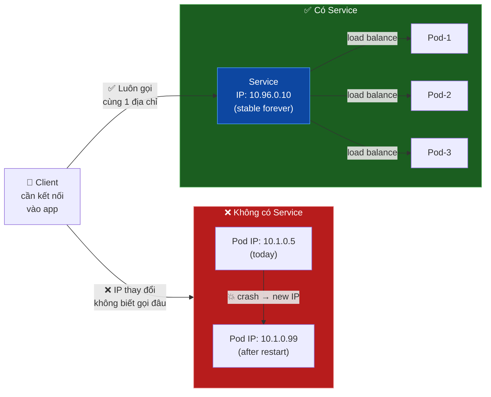
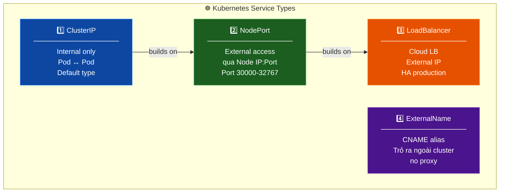
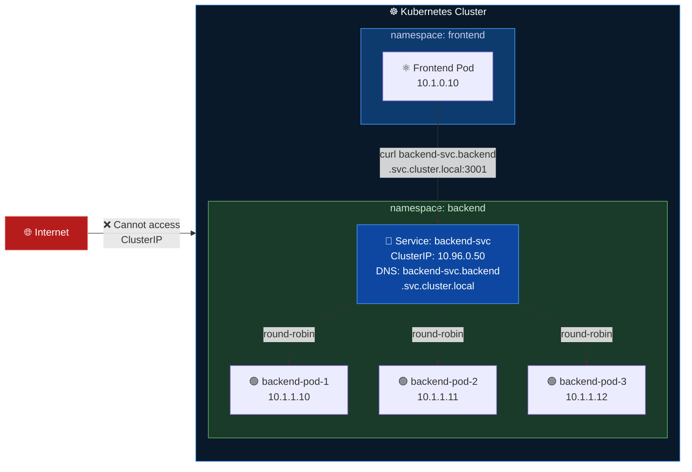
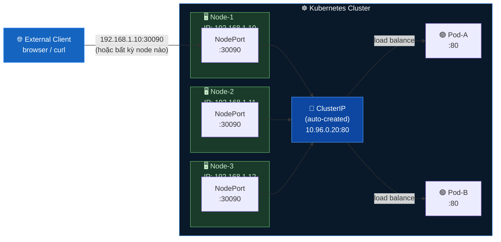
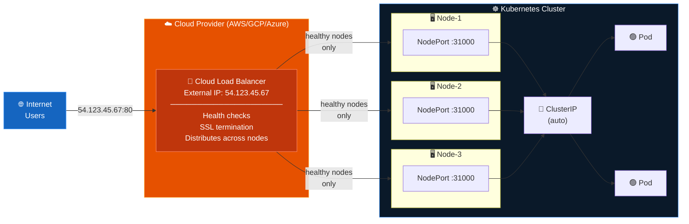
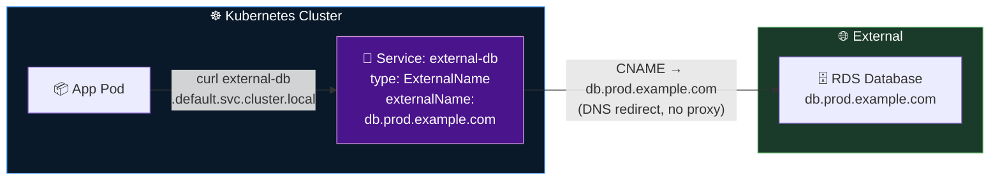
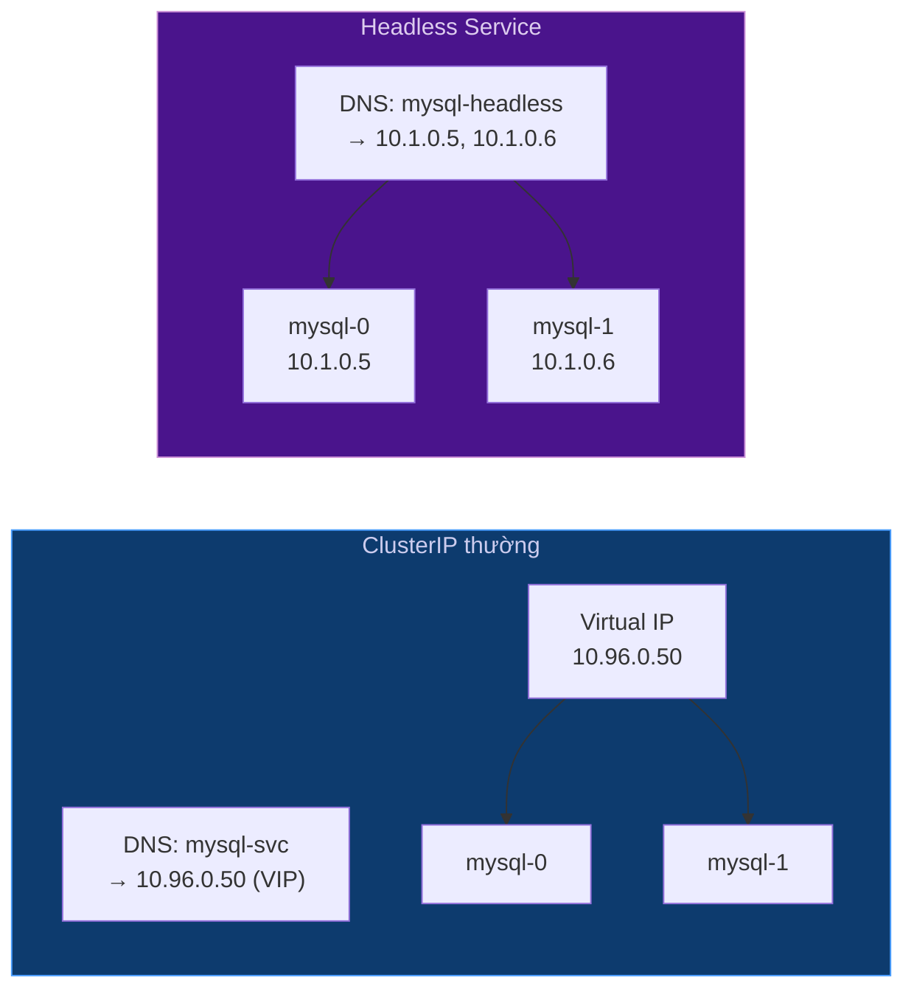
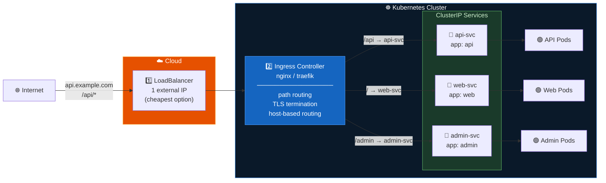
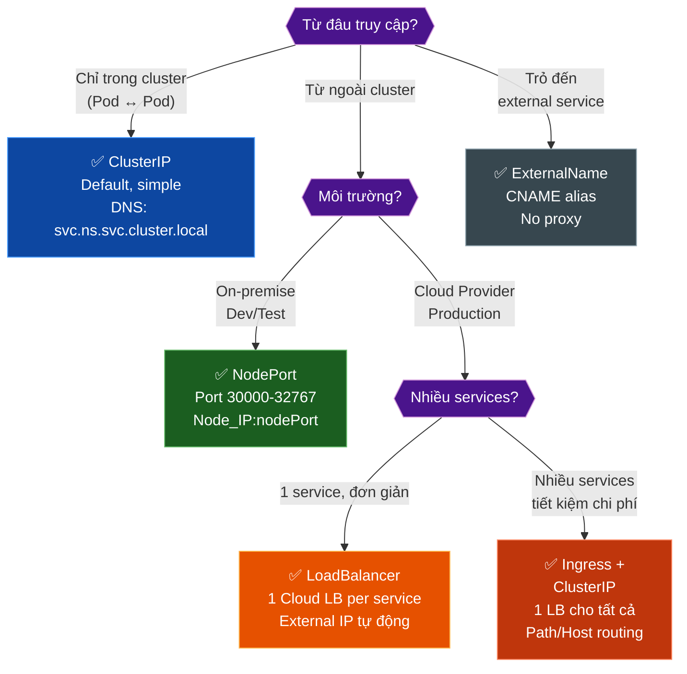
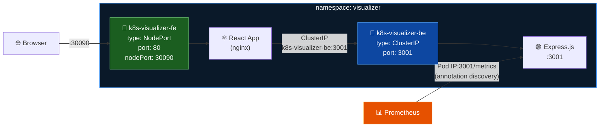

# Kubernetes Services — Giải thích trực quan

> 📖 Nguồn tổng hợp từ:
> - [KodeKloud — ClusterIP vs NodePort vs LoadBalancer](https://kodekloud.com/blog/clusterip-nodeport-loadbalancer/)
> - [vCluster — A Clear and Complete Guide to Kubernetes Services](https://www.vcluster.com/blog/a-clear-and-complete-guide-to-kubernetes-services)
> - [Medium — Kubernetes Services Simply Visually Explained](https://medium.com/swlh/kubernetes-services-simply-visually-explained-2d84e58d70e5)

---

## Tại sao cần Service?

Pod IP không ổn định — Pod bị xóa/restart sẽ có IP mới. Client không thể track được.



**Service** cung cấp:
- **Stable IP + DNS name** bất kể Pod restart
- **Load balancing** tự động đến các Pod phía sau
- **Service discovery** qua DNS: `<service>.<namespace>.svc.cluster.local`

---

## Tổng quan 4 loại Service



---

## 1. ClusterIP — Internal Communication

> Loại **mặc định**. Chỉ accessible **bên trong cluster**. Pod ↔ Pod.



### YAML

```yaml
apiVersion: v1
kind: Service
metadata:
  name: backend-svc
  namespace: backend
spec:
  type: ClusterIP       # Mặc định, có thể bỏ qua
  selector:
    app: backend        # Match pods có label này
  ports:
    - name: http
      port: 3001        # Port của Service
      targetPort: 3001  # Port của Pod
      protocol: TCP
```

### DNS Resolution

```bash
# Từ bất kỳ Pod nào trong cluster
curl backend-svc.backend.svc.cluster.local:3001

# Trong cùng namespace, có thể viết tắt
curl backend-svc:3001

# Xem ClusterIP được gán
kubectl get svc backend-svc
```

---

## 2. NodePort — External Access qua Node

> Expose service ra ngoài cluster bằng cách **mở port trên tất cả Node**.



### YAML

```yaml
apiVersion: v1
kind: Service
metadata:
  name: frontend-svc
spec:
  type: NodePort
  selector:
    app: frontend
  ports:
    - name: http
      port: 80          # ClusterIP port (Pod-to-Pod)
      targetPort: 80    # Port trên Pod
      nodePort: 30090   # Port trên Node (30000-32767)
                        # Bỏ qua để K8s tự assign
      protocol: TCP
```

### Traffic flow

```
External Client
    │ 192.168.1.10:30090
    ▼
Node (bất kỳ)
    │ NodePort :30090
    ▼
ClusterIP Service (auto-created)
    │ round-robin
    ▼
Pod :80
```

> ⚠️ **Hạn chế NodePort:**
> - Không có load balancing giữa các Node — client chọn Node nào thì traffic vào Node đó
> - Port range bị giới hạn: `30000–32767`
> - Dùng cho **dev/testing**, không khuyến nghị production

---

## 3. LoadBalancer — Cloud-Native External Access

> **Tự động tạo Cloud Load Balancer** (AWS ALB/NLB, GCP LB, Azure LB). Có external IP duy nhất.



### YAML

```yaml
apiVersion: v1
kind: Service
metadata:
  name: web-app-svc
  annotations:
    # AWS specific — tạo NLB thay vì CLB
    service.beta.kubernetes.io/aws-load-balancer-type: "nlb"
spec:
  type: LoadBalancer
  selector:
    app: web-app
  ports:
    - name: http
      port: 80
      targetPort: 8080
      protocol: TCP
```

### Traffic flow

```
Internet User
    │ 54.123.45.67:80
    ▼
Cloud Load Balancer  ← health check, SSL, distribute
    │ balanced across nodes
    ▼
Node (NodePort :31000)  ← auto-created
    │
    ▼
ClusterIP Service  ← auto-created
    │ round-robin
    ▼
Pod :8080
```

> ⚠️ **Lưu ý:** Mỗi LoadBalancer Service tạo ra **1 Cloud LB riêng** → **tốn tiền**.  
> Dùng **Ingress + 1 LoadBalancer** để expose nhiều service qua 1 IP.

---

## 4. ExternalName — CNAME Alias ra ngoài

> Không proxy traffic. Chỉ trả về **CNAME DNS record** trỏ ra service bên ngoài cluster.



### YAML

```yaml
apiVersion: v1
kind: Service
metadata:
  name: external-db
  namespace: production
spec:
  type: ExternalName
  externalName: db.prod.example.com  # Hostname bên ngoài
  # Không cần selector, không có ClusterIP
```

### Use Cases

```bash
# App trong cluster gọi external service bằng tên ngắn
curl external-db.production.svc.cluster.local:5432

# Khi migrate DB: chỉ cần đổi externalName, không cần sửa code
# external-db → old-db.prod.com  (before)
# external-db → new-db.prod.com  (after migration)
```

---

## 5. Headless Service

> `clusterIP: None` — Không có virtual IP. DNS trả về **trực tiếp IP của từng Pod**.



```yaml
apiVersion: v1
kind: Service
metadata:
  name: mysql-headless
spec:
  clusterIP: None       # Headless!
  selector:
    app: mysql
  ports:
    - port: 3306
```

> 💡 **StatefulSet** dùng Headless Service để tạo DNS ổn định cho từng Pod:
> `mysql-0.mysql-headless.default.svc.cluster.local`

---

## 6. Ingress — Kết hợp với Service

> **Ingress** không phải Service type, nhưng thường dùng với ClusterIP để expose nhiều service qua **1 external IP**.



---

## 7. Tổng quan so sánh



### Bảng so sánh

| | ClusterIP | NodePort | LoadBalancer | ExternalName |
|---|:---:|:---:|:---:|:---:|
| **Accessible từ** | Inside cluster | External | External | Inside cluster |
| **External IP** | ❌ | Node IPs | ✅ Cloud IP | ❌ |
| **Load balancing (Pods)** | ✅ | ✅ | ✅ | ❌ |
| **Load balancing (Nodes)** | N/A | ❌ | ✅ | N/A |
| **Cloud required** | ❌ | ❌ | ✅ | ❌ |
| **Cost** | Free | Free | 💰 Per LB | Free |
| **Production ready** | ✅ | Dev/Test | ✅ | ✅ |
| **Port range limit** | ❌ | 30000-32767 | ❌ | ❌ |

---

## 8. Liên hệ project K8s Visualizer



| Service | Type | Lý do |
|---|---|---|
| `k8s-visualizer-fe` | NodePort :30090 | Expose UI ra ngoài để browser truy cập |
| `k8s-visualizer-be` | ClusterIP :3001 | Chỉ FE cần gọi BE, không expose ra ngoài |

> 💡 Trong production thực tế nên đổi sang **Ingress + ClusterIP** cho cả FE và BE — tận dụng TLS termination và domain routing.

---

## Commands tham khảo

```bash
# Xem tất cả services
kubectl get svc -A

# Chi tiết một service
kubectl describe svc <service-name> -n <namespace>

# Test ClusterIP từ bên trong cluster
kubectl run test --image=curlimages/curl -it --rm -- curl <svc-name>:<port>

# Test NodePort từ bên ngoài
curl <node-ip>:<nodePort>

# Xem endpoint thực của service (pod IPs)
kubectl get endpoints <service-name>

# Port-forward để test local (không cần expose)
kubectl port-forward svc/<service-name> 8080:80
```
