# Phân tích: Kubernetes Kubeconfig File

> 📖 Nguồn: [Kubeconfig File Explained – DevOpsCube](https://devopscube.com/kubernetes-kubeconfig-file/)  
> ✍️ Tác giả: Bibin Wilson | 📅 Cập nhật: May 30, 2025


---

## 1. Kubeconfig là gì?

Kubeconfig là một file **YAML** chứa toàn bộ thông tin để `kubectl` xác thực và kết nối tới Kubernetes API Server.

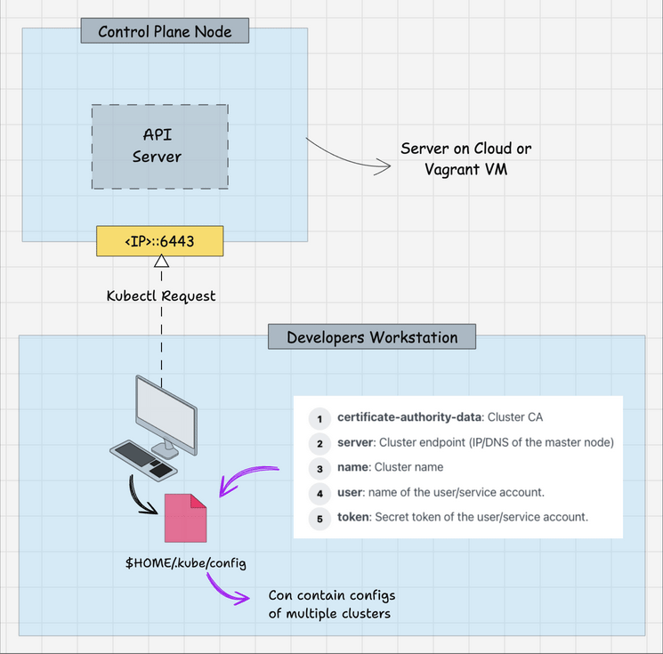

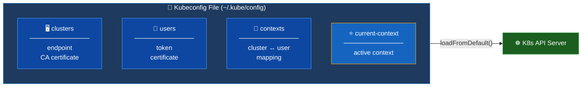

> 💡 Không chỉ người dùng — **controller-manager**, **scheduler**, **kubelet** cũng dùng kubeconfig để giao tiếp với API Server. Các file này nằm tại `/etc/kubernetes/` trên control plane node.

---

## 2. Cấu trúc file Kubeconfig

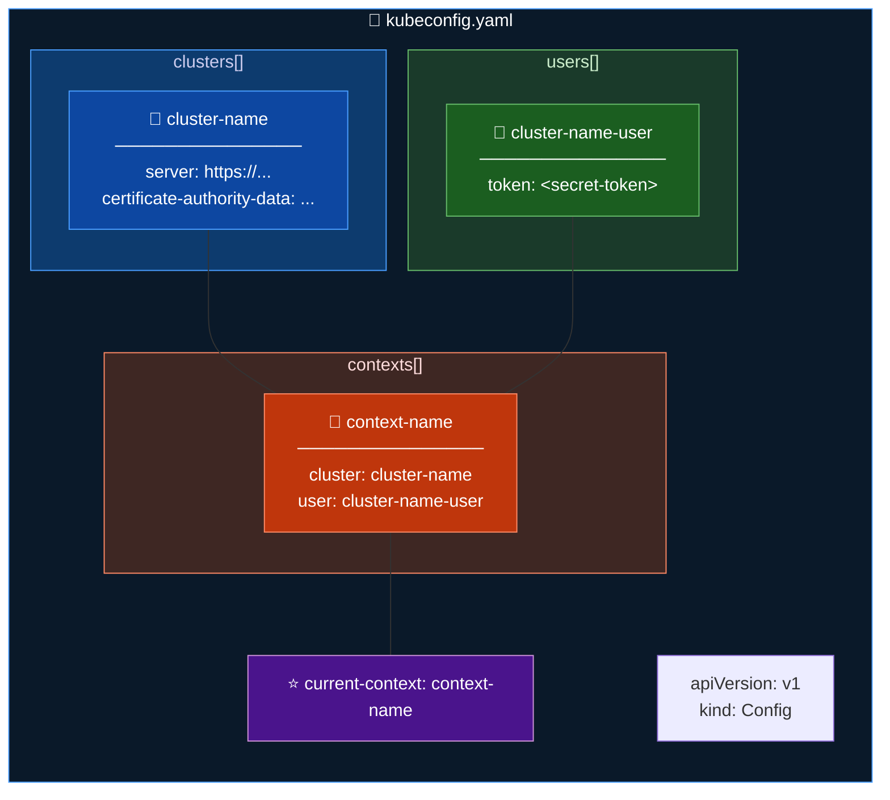

### 5 thông tin bắt buộc

| # | Field | Mô tả |
|---|---|---|
| 1 | `certificate-authority-data` | CA certificate của cluster (base64) |
| 2 | `server` | Endpoint API Server (IP hoặc DNS) |
| 3 | `name` | Tên cluster |
| 4 | `user` | Tên user / service account |
| 5 | `token` | Secret token để xác thực |

---

## 3. Thứ tự ưu tiên khi dùng Kubeconfig

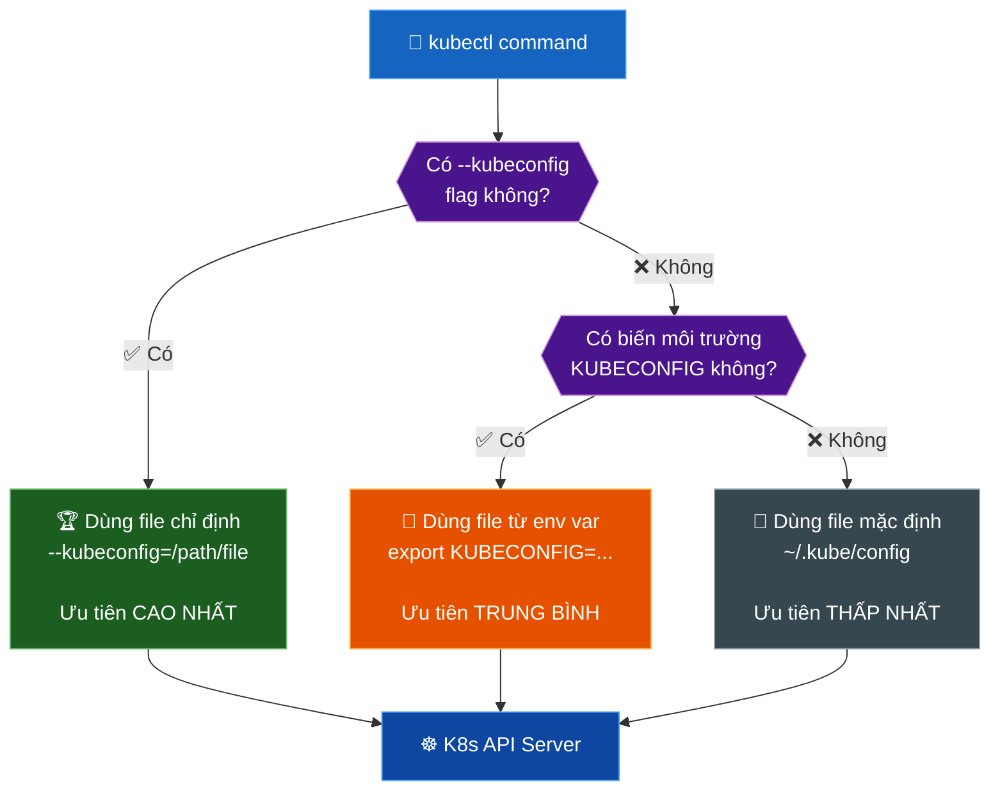

---

## 4. Ba cách sử dụng Kubeconfig

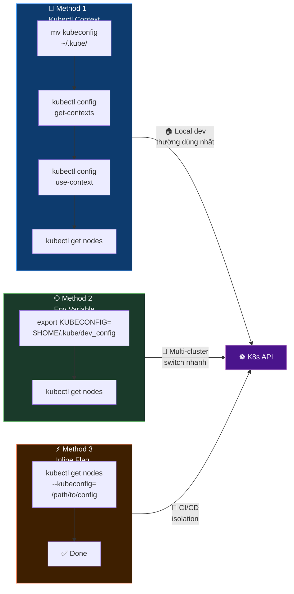

---

## 5. Merge nhiều Kubeconfig

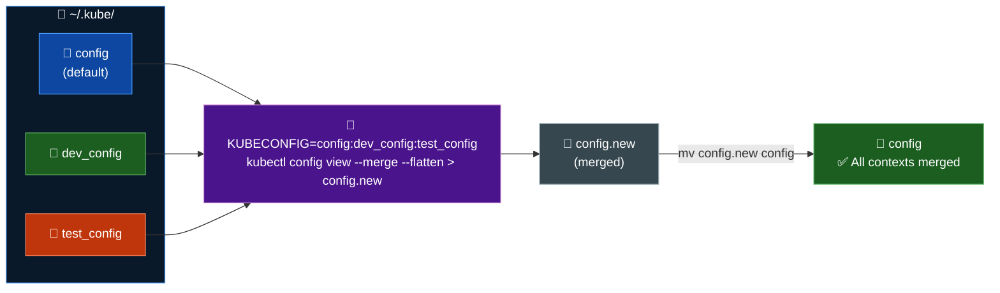

---

## 6. Tạo Kubeconfig tùy chỉnh (ServiceAccount)

Dùng khi cần cấp quyền truy cập cluster cho developer với **quyền hạn chế**.

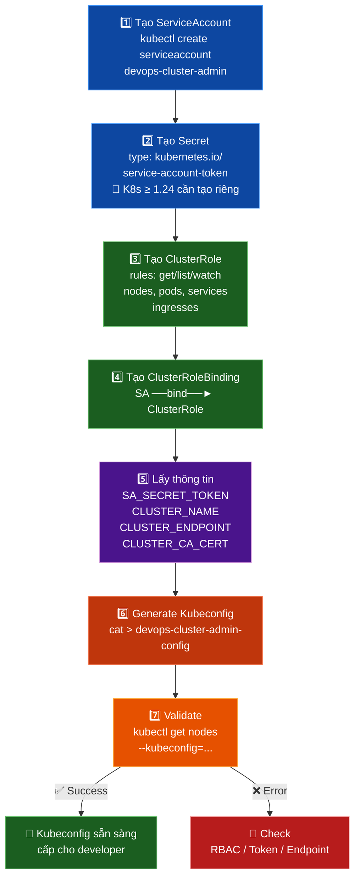

### Ví dụ tạo ServiceAccount có quyền đọc cluster

```bash
# 1. Tạo ServiceAccount
kubectl -n kube-system create serviceaccount devops-cluster-admin

# 2. Tạo Secret (K8s >= 1.24 cần tạo riêng)
cat <<EOF | kubectl apply -f -
apiVersion: v1
kind: Secret
metadata:
  name: devops-cluster-admin-secret
  namespace: kube-system
  annotations:
    kubernetes.io/service-account.name: devops-cluster-admin
type: kubernetes.io/service-account-token
EOF

# 3. Tạo ClusterRole (chỉ get/list/watch)
cat <<EOF | kubectl apply -f -
apiVersion: rbac.authorization.k8s.io/v1
kind: ClusterRole
metadata:
  name: devops-cluster-admin
rules:
  - apiGroups: [""]
    resources: [nodes, pods, services, endpoints]
    verbs: [get, list, watch]
  - apiGroups: [extensions]
    resources: [ingresses]
    verbs: [get, list, watch]
EOF

# 4. ClusterRoleBinding
cat <<EOF | kubectl apply -f -
apiVersion: rbac.authorization.k8s.io/v1
kind: ClusterRoleBinding
metadata:
  name: devops-cluster-admin
roleRef:
  apiGroup: rbac.authorization.k8s.io
  kind: ClusterRole
  name: devops-cluster-admin
subjects:
  - kind: ServiceAccount
    name: devops-cluster-admin
    namespace: kube-system
EOF

# 5. Lấy thông tin cluster
export SA_SECRET_TOKEN=$(kubectl -n kube-system get secret/devops-cluster-admin-secret \
  -o=go-template='{{.data.token}}' | base64 --decode)
export CLUSTER_NAME=$(kubectl config current-context)
export CLUSTER_ENDPOINT=$(kubectl config view --raw \
  -o=go-template='{{range .clusters}}{{if eq .name "'''${CLUSTER_NAME}'''"}}{{ .cluster.server }}{{end}}{{end}}')
export CLUSTER_CA_CERT=$(kubectl config view --raw \
  -o=go-template='{{range .clusters}}{{if eq .name "'''${CLUSTER_NAME}'''"}}{{ index .cluster "certificate-authority-data" }}{{end}}{{end}}')

# 6. Generate kubeconfig
cat <<EOF > devops-cluster-admin-config
apiVersion: v1
kind: Config
current-context: ${CLUSTER_NAME}
contexts:
  - name: ${CLUSTER_NAME}
    context:
      cluster: ${CLUSTER_NAME}
      user: devops-cluster-admin
clusters:
  - name: ${CLUSTER_NAME}
    cluster:
      certificate-authority-data: ${CLUSTER_CA_CERT}
      server: ${CLUSTER_ENDPOINT}
users:
  - name: devops-cluster-admin
    user:
      token: ${SA_SECRET_TOKEN}
EOF

# 7. Validate
kubectl get nodes --kubeconfig=devops-cluster-admin-config
```

---

## 7. Xóa Context khỏi Kubeconfig

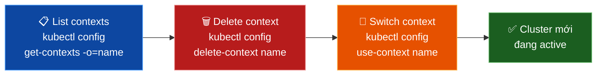

---

## 8. Security Best Practices

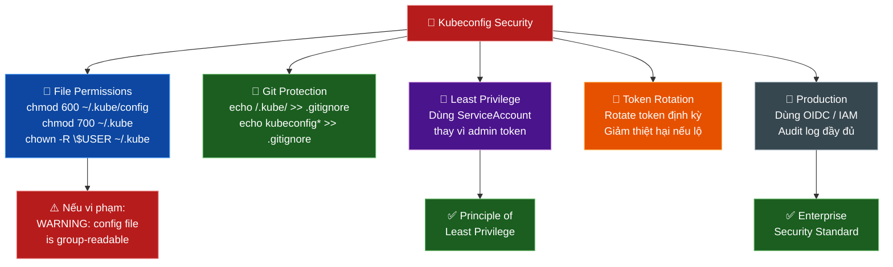

### Bảng tổng hợp

| ✅ Thực hành | 🎯 Lý do |
|---|---|
| `chmod 600 ~/.kube/config` | Chặn người khác đọc token/cert |
| Không commit kubeconfig lên Git | Token bị lộ = mất cluster |
| Dùng ServiceAccount thay vì admin token | Principle of least privilege |
| Rotate token định kỳ | Giảm thiệt hại nếu bị lộ |
| Dùng OIDC trong production | Tích hợp IAM, có audit log |
| `proxy-url` trong kubeconfig | Hoạt động sau corporate firewall |

---

## 9. Liên hệ với project K8s Visualizer

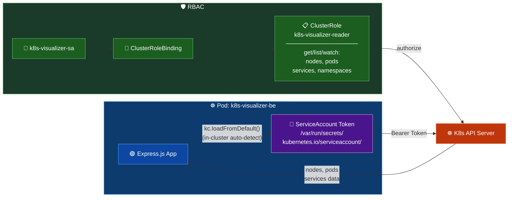

---

## 10. Tóm tắt tổng quan

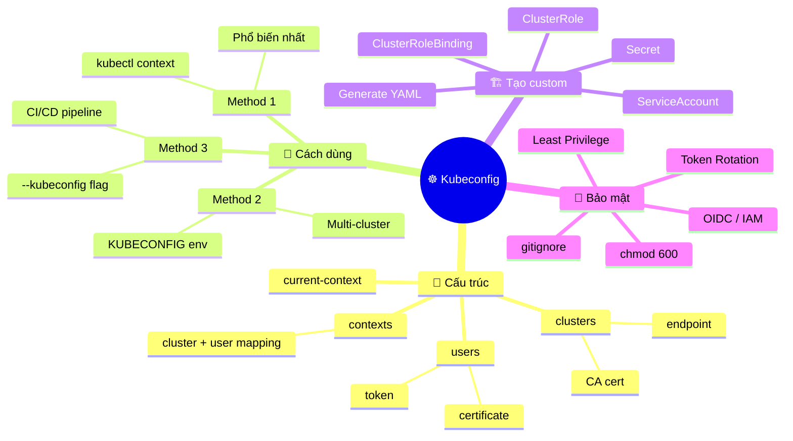
