# K8s Cluster Visualizer — Phân tích Kiến trúc Hệ thống

> Repo: [NguyenKhanhDuy2703/k8s-learn-pratice](https://github.com/NguyenKhanhDuy2703/k8s-learn-pratice)

---

## 1. Tổng quan

**K8s Cluster Visualizer** là web dashboard để visualize Kubernetes cluster theo thời gian thực, phong cách ArgoCD — hiển thị Service → WorkerNode → Pod theo từng namespace với layout tự động.

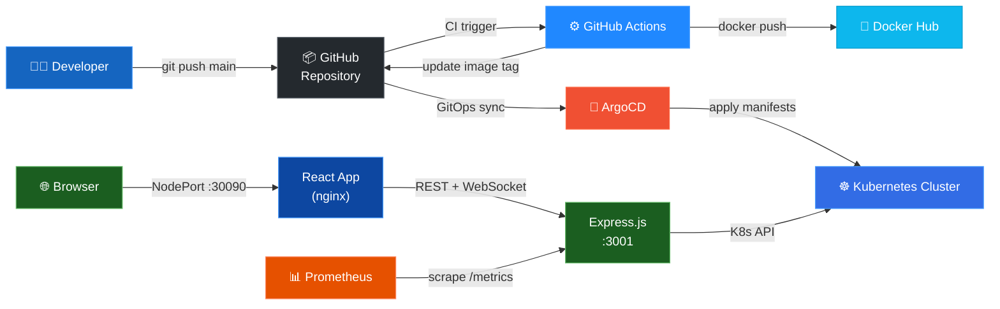

---

## 2. Tech Stack

| Layer | Công nghệ | Ghi chú |
|---|---|---|
| **Backend** | Node.js 20 + Express 4 | REST API + Socket.io realtime |
| **K8s Client** | `@kubernetes/client-node` | Official JS client |
| **Frontend** | React 18 + Vite 5 | SPA |
| **Graph Layout** | `@xyflow/react` + `dagre` | ArgoCD-style LR diagram |
| **Realtime** | Socket.io | Pod watch events |
| **HTTP Client** | axios | FE → BE calls |
| **Web Server** | nginx:alpine | Serve static FE build |
| **Container** | Docker multi-stage | BE: single-stage, FE: 2-stage |
| **CI** | GitHub Actions | Reusable workflow templates |
| **CD** | ArgoCD (App of Apps) | GitOps pattern |
| **Policy** | OPA Gatekeeper | Admission control |
| **Observability** | Prometheus text format | `/metrics` endpoint |

---

## 3. Kiến trúc Backend

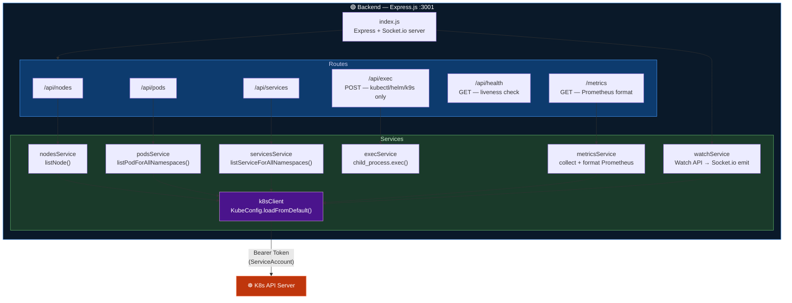

### API Endpoints

| Method | Path | Mô tả | Auth |
|---|---|---|---|
| `GET` | `/api/nodes` | Danh sách node: name, status, capacity | ServiceAccount |
| `GET` | `/api/pods` | Danh sách pod all namespaces: name, ns, status, restartCount, labels | ServiceAccount |
| `GET` | `/api/services` | Danh sách service all namespaces: name, type, selector, ports | ServiceAccount |
| `POST` | `/api/exec` | Chạy lệnh kubectl/helm/k9s/minikube | Whitelist |
| `GET` | `/api/health` | Health check `{status: "ok"}` | Public |
| `GET` | `/metrics` | Prometheus text exposition format 0.0.4 | Public (ClusterIP) |

### Realtime — Watch Service

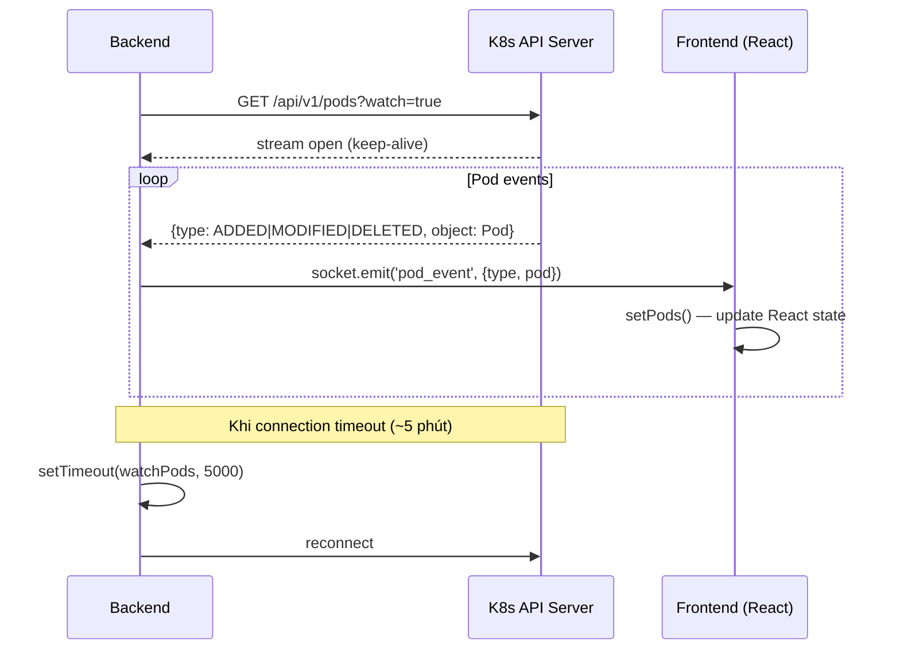

---

## 4. Kiến trúc Frontend

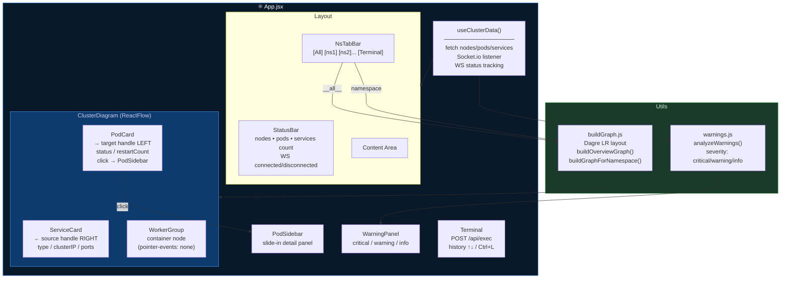

### Graph Layout — Dagre LR

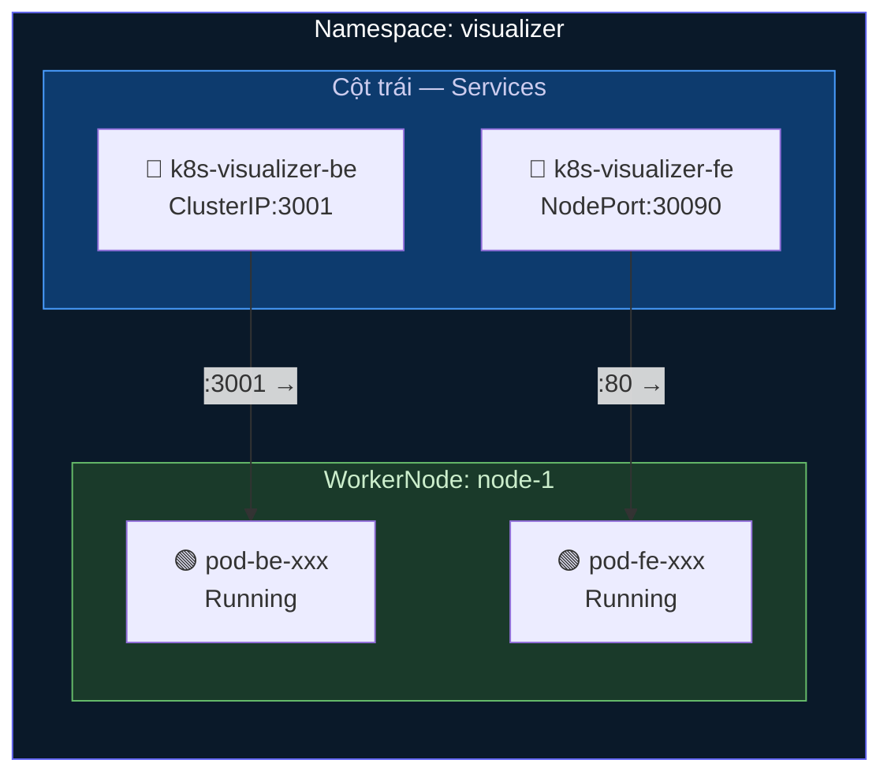

### Warning Logic

| Condition | Severity | Reason |
|---|---|---|
| `status == 'Failed'` | 🔴 Critical | Pod Failed |
| `restartCount >= 20` | 🔴 Critical | CrashLoopBackOff |
| `status == 'Unknown'` | 🟡 Warning | Node unreachable |
| `restartCount >= 5` | 🟡 Warning | High Restart Count |
| `Pending && !nodeName` | 🟡 Warning | Unscheduled Pod |

---

## 5. CI/CD Pipeline

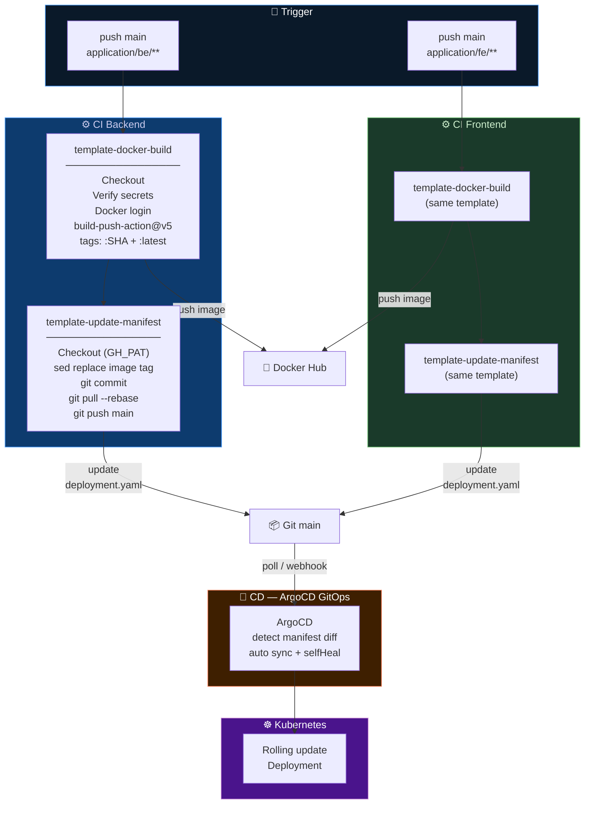

### Secrets cần thiết

| Secret | Dùng ở | Mục đích |
|---|---|---|
| `DOCKER_USERNAME` | CI build + manifest update | Docker Hub login + sed pattern |
| `DOCKER_PASSWORD` | CI build | Docker Hub push |
| `GH_PAT` | Manifest update | Push commit lên repo (bypass branch protection) |

---

## 6. ArgoCD — App of Apps

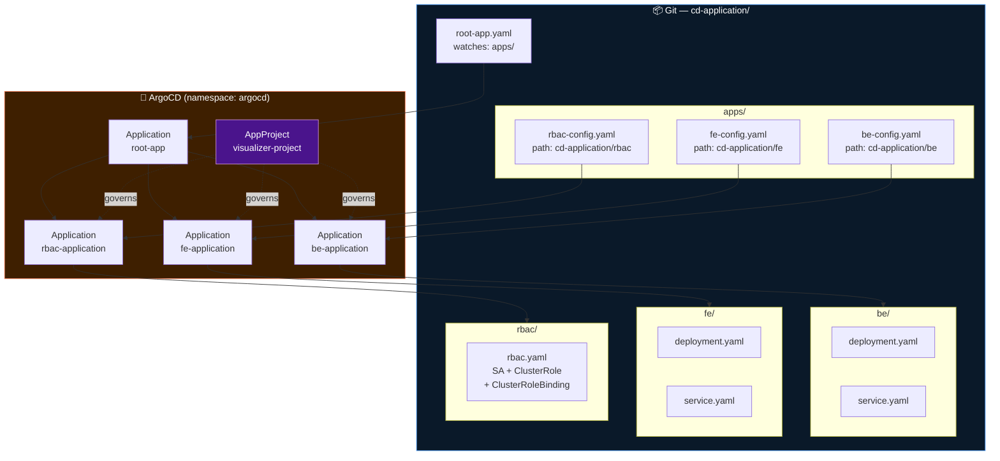

### AppProject Permissions

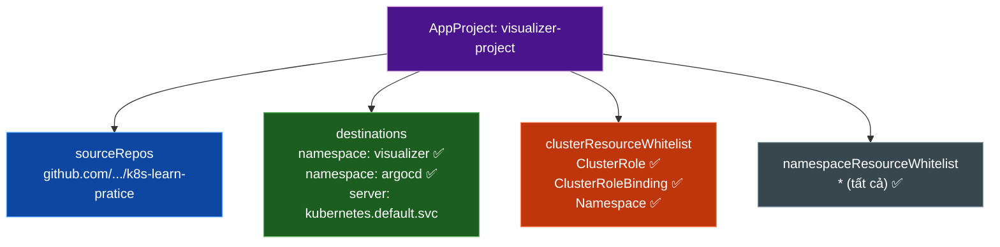

### ArgoCD RBAC

| Role | Quyền | Hạn chế |
|---|---|---|
| `admin` (default) | Full access | — |
| `readonly` (default cho anonymous) | Chỉ xem | — |
| `developer` | get, sync, action, logs trong `visualizer/*` | ❌ delete, override, exec, sửa/xóa project |

---

## 7. Kubernetes — Namespace visualizer

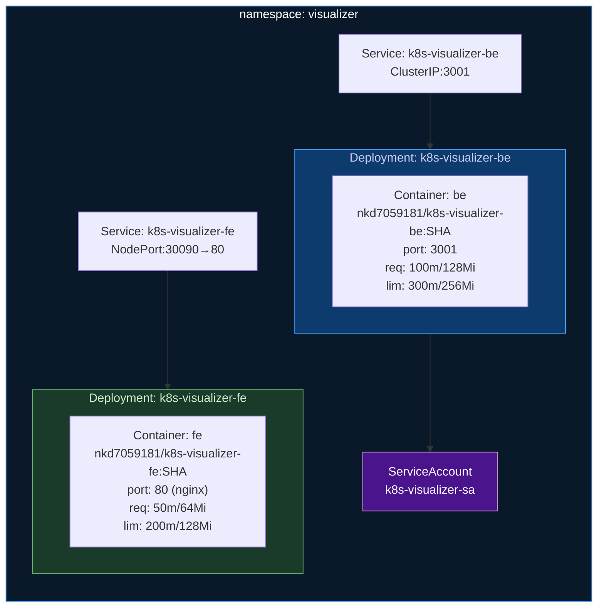

### Resource Limits

| Component | CPU Request | CPU Limit | Mem Request | Mem Limit |
|---|---|---|---|---|
| Backend | 100m | 300m | 128Mi | 256Mi |
| Frontend | 50m | 200m | 64Mi | 128Mi |

### Health Probes

| Component | Readiness | Liveness |
|---|---|---|
| Backend | `GET /api/health` delay:5s period:10s | `GET /api/health` delay:15s period:20s |
| Frontend | `GET /` delay:5s period:10s | — |

---

## 8. Security Architecture

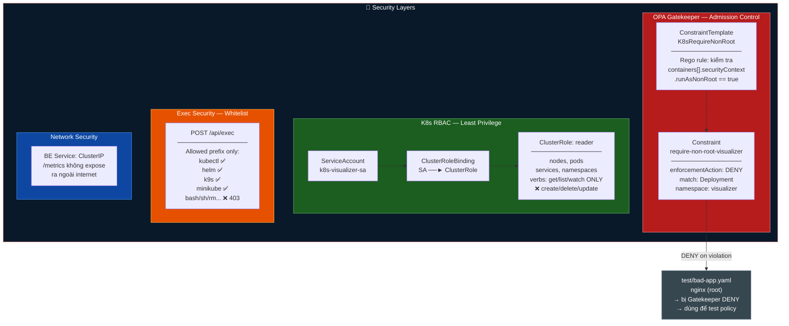

---

## 9. Observability — Prometheus Metrics

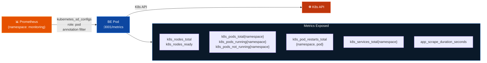

**Pod Annotation để Prometheus tự discovery:**
```yaml
annotations:
  prometheus.io/scrape: "true"
  prometheus.io/port:   "3001"
  prometheus.io/path:   "/metrics"
```

---

## 10. Cấu trúc thư mục

```
k8s-learn-pratice/
│
├── .github/workflows/
│   ├── ci-backend.yaml              # Trigger: application/be/**
│   ├── ci-frontend.yaml             # Trigger: application/fe/**
│   ├── template-docker-build.yaml   # Reusable: build + push image
│   └── template-update-manifest.yaml # Reusable: update image tag in Git
│
├── application/
│   ├── be/                          # Node.js Express backend
│   │   ├── index.js                 # Entry: Express + Socket.io
│   │   ├── routes/                  # nodes, pods, services, exec, metrics
│   │   ├── services/                # k8sClient, nodesService, podsService,
│   │   │                            # servicesService, execService,
│   │   │                            # watchService, metricsService
│   │   └── Dockerfile               # node:20-alpine, single-stage
│   │
│   └── fe/                          # React + Vite frontend
│       ├── src/
│       │   ├── App.jsx              # Root component
│       │   ├── api/k8sApi.js        # axios REST calls
│       │   ├── hooks/useClusterData.js # fetch + WS listener
│       │   ├── components/          # ClusterDiagram, StatusBar, NsTabBar,
│       │   │                        # PodSidebar, Terminal, WarningPanel
│       │   │   └── nodes/           # ServiceCard, PodCard, WorkerGroup, NsGroup
│       │   └── utils/
│       │       ├── buildGraph.js    # Dagre LR layout
│       │       └── warnings.js      # Pod warning analysis
│       ├── nginx.conf               # SPA fallback + gzip
│       └── Dockerfile               # Multi-stage: node build → nginx serve
│
└── cd-application/
    ├── root-app.yaml                # ArgoCD App of Apps entry point
    ├── project.yaml                 # AppProject: permissions + destinations
    ├── apps/
    │   ├── be-config.yaml           # ArgoCD App → cd-application/be/
    │   ├── fe-config.yaml           # ArgoCD App → cd-application/fe/
    │   └── rbac-config.yaml         # ArgoCD App → cd-application/rbac/
    ├── be/
    │   ├── deployment.yaml          # BE Deployment + Prometheus annotations
    │   └── service.yaml             # ClusterIP:3001
    ├── fe/
    │   ├── deployment.yaml          # FE Deployment
    │   └── service.yaml             # NodePort:30090
    ├── rbac/
    │   └── rbac.yaml                # ServiceAccount + ClusterRole + Binding
    ├── policy/
    │   ├── constrainttemplate-non-root.yaml  # OPA Rego rule
    │   └── constraint-non-root.yaml          # Enforce trên namespace visualizer
    ├── configmap/
    │   ├── argocd-cm-patch.yaml     # Tạo account 'developer'
    │   └── argocd-rbac-cm.yaml      # RBAC policy cho ArgoCD
    ├── service_monitoring/
    │   └── servicemonitor.yaml      # (TODO: ServiceMonitor cho Prometheus Operator)
    └── test/
        └── bad-app.yaml             # nginx root — dùng test Gatekeeper policy
```

---

## 11. Điểm cần cải tiến

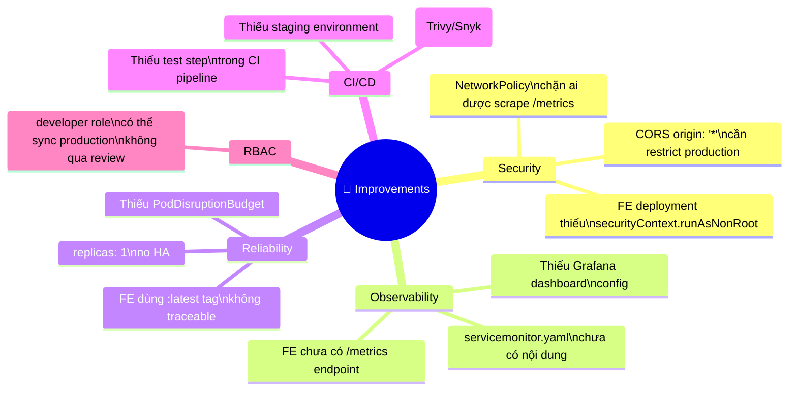

### Chi tiết

| # | Vấn đề | Mức độ | Giải pháp đề xuất |
|---|---|---|---|
| 1 | FE deployment thiếu `runAsNonRoot: true` | 🔴 High | Thêm `securityContext` — hiện bị Gatekeeper chặn nên FE không deploy được |
| 2 | FE dùng `:latest` tag | 🟡 Medium | Dùng commit SHA giống BE, cập nhật CI workflow |
| 3 | `servicemonitor.yaml` trống | 🟡 Medium | Thêm ServiceMonitor config cho Prometheus Operator |
| 4 | `CORS: origin: '*'` | 🟡 Medium | Restrict về FE domain trong production |
| 5 | Không có NetworkPolicy | 🟡 Medium | Chỉ cho namespace `monitoring` scrape `/metrics` |
| 6 | CI thiếu test + image scan | 🟡 Medium | Thêm `npm test` + Trivy scan trước khi push |
| 7 | `replicas: 1` cả BE lẫn FE | 🟢 Low | Tăng lên 2+ cho HA, thêm PodDisruptionBudget |
